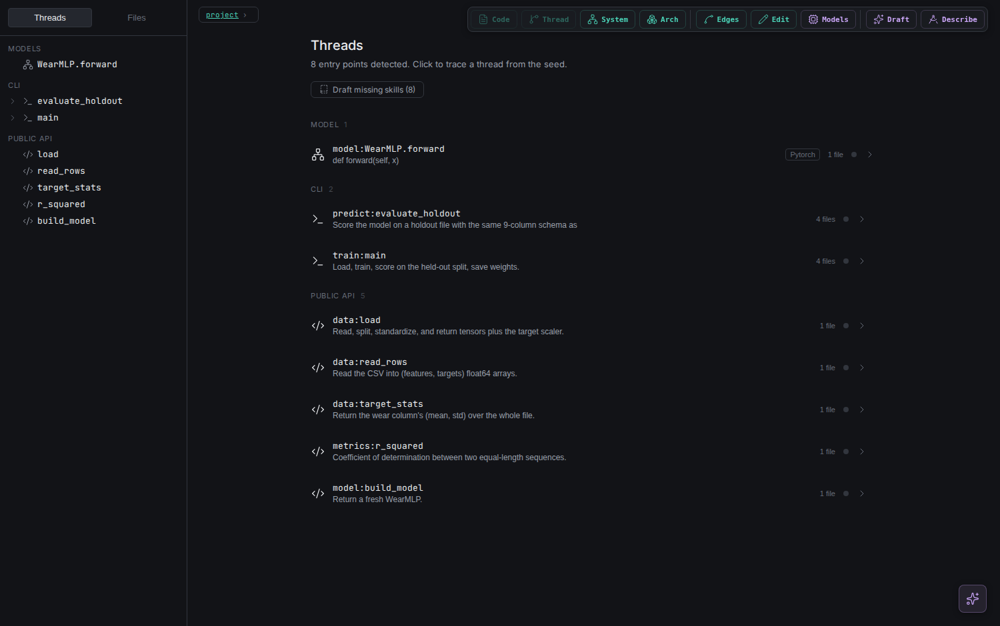
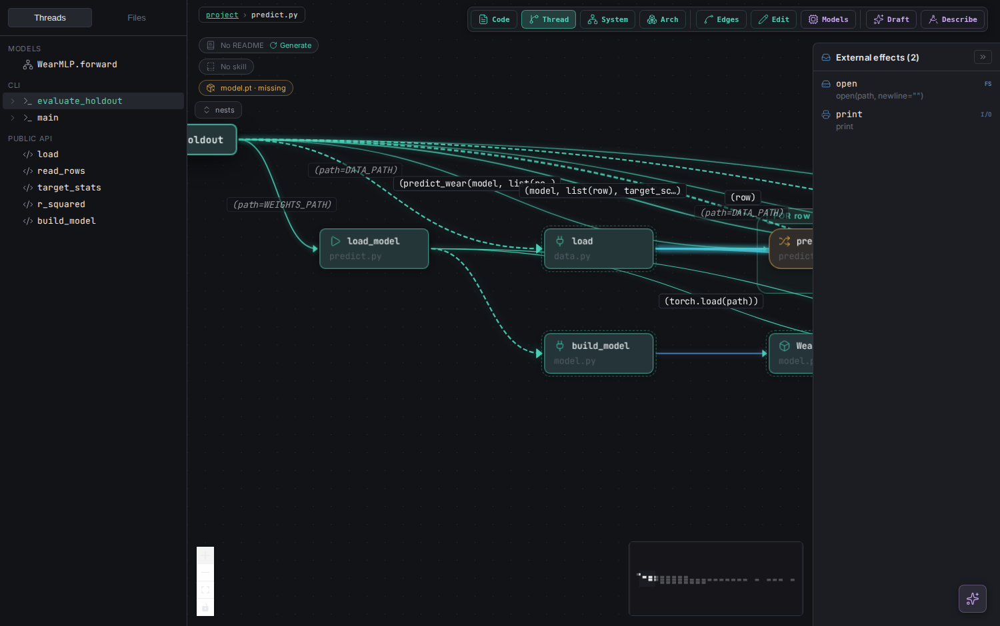
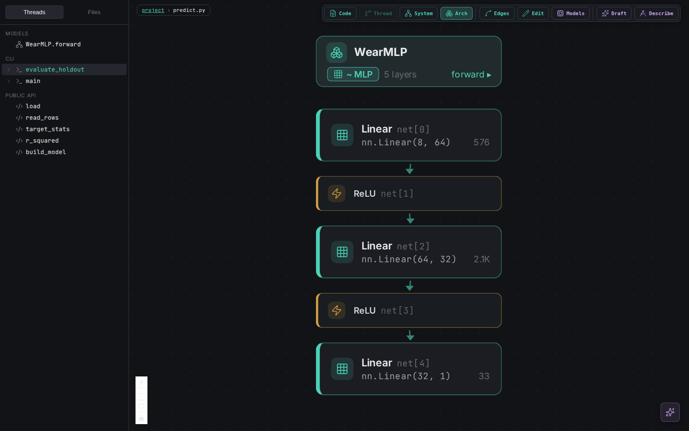
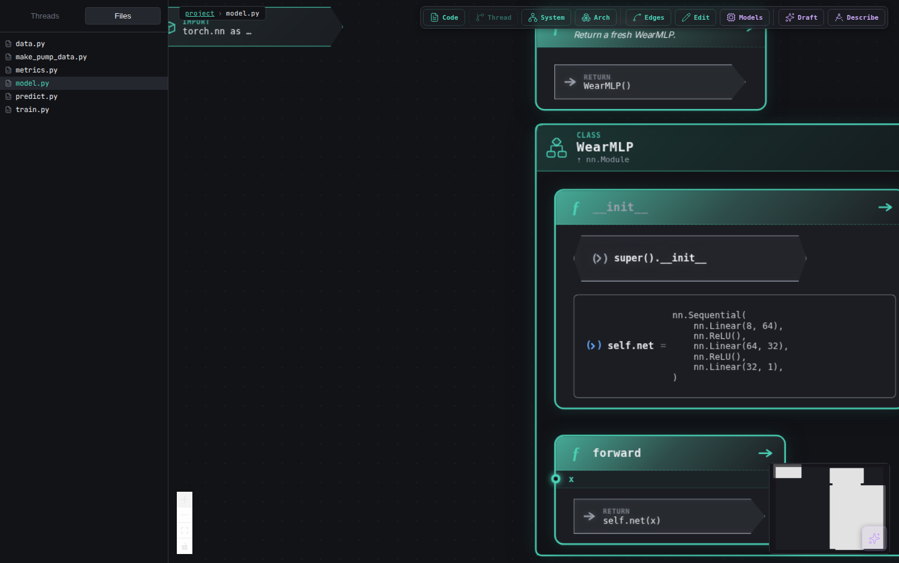

# VibeGraph

**A visual editor for Python codebases. The graph is not a diagram of your
code — it *is* your code.** Click a node and you are editing the file on
disk. Trace one execution path across five files. Run a single node and see
the real value it produced. Then plan and build new code through gates a
human has to approve.

> **Read [SECURITY.md](SECURITY.md) before pointing this at your own work.**
> VibeGraph spawns the `claude` CLI with `--dangerously-skip-permissions` in
> the project you give it, writes to your files, executes your code (in a
> sandbox copy), sends your source to Anthropic, and costs money per turn.
> Every edit is confined by a structural chokepoint and every proposal needs
> a human accept — but run it on a **git repo with a clean working tree**, so
> anything it does is one `git diff` from review.



*Open a project and VibeGraph finds its entry points, grouped by what they
are — models, CLI entries, the public API — each with its docstring summary
and how many files its thread reaches.*

---

## What it is

Most code visualizers generate a picture. The picture goes stale the moment
you edit, and you cannot edit *through* it — the diagram is downstream of the
code and always behind it.

VibeGraph inverts that. **The file on disk is the single source of truth and
the graph is a live projection of it.** Edit in the graph and libcst patches
the file. Edit the file in your own editor and a watcher re-derives the graph
within a few hundred milliseconds. There is no second model to drift out of
sync, because there is no second model.

## How it works

```
your .py files  ──libcst──▶  IR {nodes, edges, symbolIndex}  ──▶  five views
       ▲                                                              │
       └──────────── CST patch (format-and-diff confined) ◀───────────┘
```

**1. Parse to an IR.** `libcst` builds a typed graph of every construct —
functions, classes, control flow, calls, imports, DB access. A second pass
resolves references *across* files, so a call in `train.py` links to the
definition in `model.py`.

**2. Node IDs are structural paths, never line numbers.**
`module/Shape.class/area.fn/return@0` identifies a node by where it sits in
the syntax tree. Insert twenty lines above it and the ID is unchanged — which
is what lets a selection, a pinned thread or a stored annotation survive an
edit.

**3. Every edit routes through one chokepoint.** A Monaco save, a chat
rewrite, an agent-drafted insert — all of them become a `libcst` patch, which
is then formatted and diffed against the original. **If the diff touches a
line outside the node being edited, the write is rejected and nothing reaches
disk.** No line splicing, no regex rewrites, no "the model deleted a function
it wasn't asked to touch".

**4. The LLM is a guest, not the engine.** Parsing, linking, layout, thread
extraction and the edit chokepoint are all deterministic. Claude is used for
drafting and conversation, and everything it proposes lands behind a human
gate. The runtime shells out to your authenticated
[Claude Code](https://claude.com/claude-code) CLI, so it needs no
`ANTHROPIC_API_KEY` of its own — and everything except the LLM features works
without it.

## Why this is different

Four properties, none of them common in code tools:

**It is bidirectional.** Clicking a node edits the file. Diagram generators
are one-way by construction; a stale diagram is their normal state, and there
is nothing to click.

**Edits are structurally confined, not trusted.** The usual safety model for
an AI code editor is "read the diff carefully". Here the rewriter physically
cannot touch lines outside the targeted node — a bad edit is *rejected*, with
a plain-language reason, rather than written and reviewed afterwards.

**Uncertainty is typed, not flattened.** When a call can't be resolved,
VibeGraph distinguishes *"this is genuine runtime dispatch, no static answer
exists"* from *"the linker missed it"*, and never renders one as the other.
Executing a node on made-up inputs prints the fabricated premise next to the
value. A truncated value says it was truncated. The design rule is that
**you should never have to guess whether what you're looking at is true** —
which matters more, not less, once an LLM is writing some of it.

**Running code is part of reading it.** Hover any node that produces a value
and run to it. The real code executes up to that point in a throwaway copy of
your project and shows you the actual value. Side effects are gated by an
interprocedural scan, and when a required input doesn't exist, Claude drafts
an example and binds your consent to its content hash.

## What it enables

- **Understand an unfamiliar codebase** by following one execution thread
  across files, instead of chasing definitions through a jump-to stack.
- **Answer "what does this actually return?"** without writing a scratch
  script, adding a print, or running the whole program.
- **Refactor with a structural safety net** — the chokepoint rejects an edit
  that reaches beyond the node you targeted.
- **Build new code through a plan you approved** — describe a project, ratify
  an architecture and a roadmap, then accept or reject each increment
  alongside the behavioural check written to prove it works.
- **See a PyTorch model as a schematic**, with per-layer parameter counts.
- **Drive all of it from your terminal.** An MCP server is mounted on the same
  process, so a Claude Code session in your shell and the built-in chat panel
  take exactly the same code path.

## Threads as the unit of knowledge — and of agent scope

This is the part that only works because the IR exists, and it is the reason
the thread abstraction earns its keep beyond being a nice view.

**A skill is attached to a thread, not to the repo.** VibeGraph drafts a
short document describing what one thread does, grounded in its real
function names and explicit about what is *not* statically knowable. You read
it and **ratify** it — drafting is automatic, ratifying is always human. Only
a ratified skill is ever treated as authoritative.

**Questions route to the thread that owns them.** A deterministic remit index
matches the symbols in your question against the threads that contain them —
lexical, no model in the loop — and injects that thread's ratified skill into
the turn, with a muted `routed:` line naming the thread and the token that
matched. Ask from a node and it dispatches on that node's IR id alone.

When a skill is *not* shared, the line says why — and distinguishes two cases
that are easy to conflate: a ratified skill **withheld** this turn (stale,
over budget, or already in context) versus one that **never existed** (never
drafted, or drafted and still awaiting ratification). "No skill exists" is
never said about a skill that does exist.

**Skills go stale honestly.** Each one stamps a snapshot of its thread's
steps. When the code moves, the skill is marked stale and the card shows the
diff. Re-affirm re-stamps it without regenerating; opt into auto-reaffirm and
it keeps injecting *with* a stated caveat rather than silently going quiet.

### What that enables for agents

Because a thread is a real boundary in the IR, an agent can be scoped to
exactly one — and that scope can be enforced rather than requested.

`vibegraph_spawn_thread_agent` runs a **one-shot agent bounded to a single
thread**. Its whole context is that thread's compact execution projection,
its ratified skill, its blind-spot roll-up (what the IR says is *not*
statically knowable here), and the adjacent threads it can see but is not
scoped to. Two rules make it honest rather than merely small:

- It must answer `ESCALATE:` when a task needs anything outside its thread,
  instead of guessing across the boundary.
- It is told plainly that it cannot run, test or grep anything, and is
  forbidden from *claiming* it did. An unverified answer marked unverified is
  a good answer; an invented verification is a failure.

`vibegraph_plan_work` decomposes a task the same way: it maps the task onto
the threads that own it, orders them dependencies-first from the call graph,
and annotates each packet with its boundary counts, its escalation surface
and its skill state. It spawns nothing — the human ratifies and the driving
agent dispatches.

The whole surface is exposed over MCP (`vibegraph_extract_thread`,
`vibegraph_blast_radius`, `vibegraph_thread_blind_spots`,
`vibegraph_run_thread_to_node`, `vibegraph_rewrite_node`, …), so a Claude
Code session in your terminal drives exactly what the built-in chat drives.

## Run it

```bash
git clone https://github.com/BjaminA/vibegraph.git
cd vibegraph
npm install
./runVis.sh examples/pump-wear
```

Open <http://localhost:4200>.

`runVis.sh` bootstraps the Python deps into `.pydeps/` (libcst + black, no
`sudo`), rebuilds the webview if `dist/` is stale, and starts the server. Pass
a single file or a whole directory:

```bash
./runVis.sh path/to/one_file.py
./runVis.sh path/to/your_project/
```

To drive it from a terminal Claude Code session:

```bash
claude mcp add vibegraph --transport http http://localhost:4200/mcp
```

Then ask for things like *"show me the IR for `models.py`"*, *"select
`calculate_area`"*, or *"trace the training thread"*.

## Try it — two worked examples

Start here. Both are step-by-step and take 20–30 minutes.

| | | |
|---|---|---|
| **1** | [**examples/pump-wear**](examples/pump-wear/README.md) | A finished PyTorch project. Threads, the architecture schematic, the trained/untrained seam, three run-to-here drills, chat edits, skills, agents. |
| **2** | [**examples/pump-from-scratch**](examples/pump-from-scratch/README.md) | The same project built from an empty folder: describe it, ratify the architecture and roadmap, then judge each increment at its gate. |

Example 1 covers the exploring-and-editing half and needs no LLM usage until
its later steps. Example 2 exercises planning and verification, and every
stage is a real `claude` call.

## The views

A toolbar switches between them; a selection in any one cross-highlights the
others.

| View | What it shows |
|---|---|
| **Diagram** | One file as connected nodes — functions, classes, control flow, calls, DB access — each construct with its own shape and icon. |
| **Code** | Monaco, read-only, themed from the same tokens as the diagram. Clicking a node opens a focused editor for just that node. |
| **Thread** | One logic thread traced statically forward from a seed function, across files, branch-stacked left-to-right. Conditional calls are dashed; scope boundaries end in explicit "external" terminals. |
| **System** | Subsystems and how they relate — the project above the file level. |
| **Arch** | PyTorch models as layer schematics with parameter counts. Needs layers declared literally; `nn.Sequential(*layers)` cannot be enumerated statically and honestly collapses to a single card. |



*Thread view: `evaluate_holdout` traced across `predict.py`, `data.py` and
`model.py`, with the arguments on each edge and a `model.pt · missing` chip
that says the artifact has not been produced yet.*



*Arch view: the model as a schematic, per-layer parameter counts included.*



*Diagram view: one file as structure — the class container, its `__init__`
with the whole `nn.Sequential` visible, and `forward`.*

## Development

```bash
npm test                      # full suite: IR + thread + CST + Playwright
npm run test:ir               # parser snapshot
npm run test:thread           # thread extractor snapshot
npm run test:cst              # the rewriter's ops and their diff confinement
npm run test:example-pump     # the pump example, pinned against its README
npx playwright test           # webview specs
```

Scale benchmark, gated so `npm test` doesn't pay for it:

```bash
VG_BENCH=1 VG_FIXTURE=test/fixtures/scale/src \
  npx playwright test test/e2e/m6-scale-benchmark.spec.ts
```

### Layout

```
server.ts                WebSocket runtime + MCP server (one process)
scripts/
  parse_cst.py           libcst parser — single file or whole project
  cross_file_link.py     project symbol index + cross-file reference edges
  cst_rewrite.py         every edit op, with format-and-diff confinement
  extract_thread.py      static forward-trace thread extractor
  scan_effects.py        interprocedural effect floor for run-to-here
schemas/ir.schema.json   the pinned IR contract
src/
  shared/protocol.ts     server ↔ webview wire protocol
  webview/               React + React Flow + Monaco
    nodes/               one component per construct
    threads/             thread layout and rendering
    styles/tokens.css    canonical design tokens
examples/                the two worked examples
test/                    fixtures, snapshots, Playwright specs
```

Design references: [`design/COLOURS.md`](design/COLOURS.md),
[`design/ICONS.md`](design/ICONS.md), and
[`schemas/ir.schema.json`](schemas/ir.schema.json) for the IR contract.

## Where this is going

Two strands, deliberately separate.

### 1. More languages

The IR is Python-only today and honestly says so: `libcst` is the parser, and
some Python-isms are baked into the node grammar. The intent is to widen it
to **TypeScript / JavaScript, Bash, C++ and Rust**.

That is a language *frontend* pass plus a new IR major version, not a plugin
drop-in — the structural node-ID grammar, the effect floor and the edit
chokepoint all have to mean something in each language before a view can be
trusted. Bash and TS/JS are the near end of that (interpreters, dynamic
dispatch, an existing CST story); C++ and Rust are the far end, where the
build graph matters as much as the syntax tree. The rule stays the same
whatever lands: if a construct cannot be resolved statically, the view says
so rather than guessing.

### 2. A control panel for agent orchestration

The pieces above — bounded per-thread agents, deterministic routing,
ratification gates, blast radius, an effect floor — are the primitives for
running *many* agents against one codebase. What is missing is the surface
that lets a human see and steer it: which agents are live and on which
threads, what each was scoped to, where they escalated, which proposals are
waiting on a gate, and what a fleet of them is about to touch before it
touches it.

The graph is already the natural display for that. A thread is where an agent
lives, blast radius is what its change would reach, and the ratification gate
is the place a human says yes. The intent is to make agent orchestration
something you **watch and control on the canvas**, rather than something you
infer from a scrolling log.

## Limits worth knowing

- **Python only.** The IR bakes in Python semantics. A JS/TS frontend would be
  a new IR major version, not a plugin.
- **A green check proves self-consistency, not correctness.** In the
  build-from-scratch flow, if your description is vague about a data format
  the builder invents one, writes its check against that same invention, and
  passes. Specify formats, not just field names.
- **Static tracing has honest gaps.** Runtime dispatch through `getattr`, or a
  receiver whose type isn't annotated, is marked unresolvable rather than
  guessed at.

## Security

VibeGraph runs an LLM agent with write access to your source tree. See
[SECURITY.md](SECURITY.md) for what it does on your machine, what protects
you (the edit chokepoint, the effect floor, human ratification gates,
localhost binding) and what does not (the endpoints are unauthenticated, and
`Bash` remains available to the agent).

## License

MIT — see [LICENSE](LICENSE).
