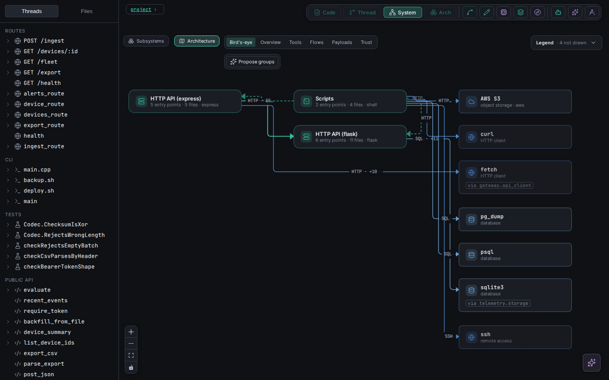

# VibeGraph

**See, run and edit a codebase as the structure it really has — and hand that
structure, and the rules your team knows, to Claude before it edits.**

VibeGraph parses your code (Python, TypeScript, bash, C++, Rust) into an IR,
traces every entry point forward as a *thread* across files and languages,
and draws the whole system as an architecture map whose every edge names the
protocol it was read from. Click a node and you are editing the file on disk,
through a chokepoint that rejects any change reaching beyond that node. The
same knowledge is exported as plain files a Claude Code session reads first.

> **Read [SECURITY.md](SECURITY.md) before pointing this at your own work.**
> The visualisation spawns the `claude` CLI with `--dangerously-skip-permissions`
> in the project you give it, writes to your files, executes your code (in a
> sandbox copy, behind a consent gate), sends your source to Anthropic and
> costs money per turn. Run it on a **git repo with a clean working tree**, so
> anything it does is one `git diff` from review.


---

## Get started

| | |
|---|---|
| **[docs/guide/SETUP.md](docs/guide/SETUP.md)** | Install, check it works on an example, point it at your code, settings, troubleshooting. |
| **[docs/guide/VISUALISATION.md](docs/guide/VISUALISATION.md)** | Using the web app on your codebase: the architecture map and its lenses, threads, running code, editing, rules, skills, agents, MCP. |
| **[docs/guide/CLI.md](docs/guide/CLI.md)** | The node commands (`vibegraph-knowledge`): every command, what it writes, what costs tokens, a team workflow. |

### The node way — one install, no clone

[`vibegraph-knowledge`](https://www.npmjs.com/package/vibegraph-knowledge) on
npm (also installed as `vgk`) derives everything from your code and writes it
where Claude Code reads it:

```bash
npm install -g vibegraph-knowledge

cd /path/to/your/project
vibegraph-knowledge init                     # point CLAUDE.md at .vibegraph/knowledge/
vibegraph-knowledge export                   # the architecture map, one contract per thread, the rules
vibegraph-knowledge constraints add --kind invariant --all \
  --text "Every outbound HTTP call goes through lib/http_client.py: it routes via the egress proxy."
vibegraph-knowledge check                    # verify the stated rules against the code
vibegraph-knowledge architecture             # the system map as .md, .json and a self-contained .html
```

Then open Claude Code in the project as usual: `CLAUDE.md` now tells it to
read the knowledge first. It needs Node 20+ and Python 3.10+ on your PATH;
the first `export` installs the Python parser (`libcst`) into
`~/.cache/vibegraph-knowledge` by itself.
Every command, and which three spend tokens: [docs/guide/CLI.md](docs/guide/CLI.md).

### The visualisation — from a clone

The browser app is not on npm yet; run it from a clone:

```bash
git clone https://github.com/BjaminA/vibegraph.git
cd vibegraph
npm install
./runVis.sh /path/to/your/project            # then open http://localhost:4200
```

The first launch installs `libcst` and `black` into `vibegraph/.pydeps/` and
builds the app (about a minute). Walkthrough:
[docs/guide/VISUALISATION.md](docs/guide/VISUALISATION.md).

You need Node 20+ and Python 3.10+ (and git for the clone). Claude Code
(`claude`, logged in) is optional: everything deterministic works without it.
On Windows, use WSL2.

## What it is

Most code visualisers generate a picture that goes stale the moment you edit,
and you cannot edit *through* it. In VibeGraph **the file on disk is the
single source of truth and every view is a live projection of it.** Edit in
the graph and a CST patch changes the file; edit the file in your own editor
and a watcher re-derives the views within a few hundred milliseconds.

```
source files ──parse──▶ IR {nodes, edges, symbolIndex} ──▶ threads · architecture map · views · exports
     ▲                                                                   │
     └────────────── CST patch (format-and-diff confined) ◀──────────────┘
```

- **Node ids are structural paths**, never line numbers
  (`module/Shape.class/area.fn/return@0`), so a selection, a skill or a rule
  survives an edit.
- **Every edit routes through one chokepoint.** A save, a chat rewrite, an
  agent's change — each becomes a CST patch, is formatted, and is diffed
  against the original. **If the diff touches a line outside the node being
  edited, it is rejected and nothing is written.**
- **Uncertainty is typed, not flattened.** A call that is genuine runtime
  dispatch reads `dynamic`; one VibeGraph could not resolve reads
  `unresolved`; the two are never merged. A value from made-up inputs says so.
  **You should never have to guess whether what you are looking at is true.**
- **The model is a guest, not the engine.** Parsing, linking, threads, the
  map, layout and the chokepoint are deterministic. Claude drafts and
  converses; everything it proposes lands behind a human gate.

## What you can do with it

- **Understand an unfamiliar system**: the architecture map shows processes,
  dispatchers and the tools they call, each edge with its protocol and the
  fact behind it; six lenses from a dozen-box bird's-eye view to the payloads
  on every edge.
- **Follow one execution path** across files and languages, instead of
  chasing definitions.
- **Answer "what does this actually return?"** — run the real code to one
  node in a throwaway copy and see the value.
- **Refactor with a structural safety net** — the chokepoint rejects an edit
  that reaches beyond the node you targeted.
- **Write down what the code cannot say** — rules with their reasons, some of
  them machine-checked against the code; deployment and trust boundaries;
  per-thread skills a person ratifies.
- **Give every Claude session all of it** — `vibegraph-knowledge export`
  writes the map, one contract per thread and the rules into
  `.vibegraph/knowledge/`, and `check` verifies the rules in a hook or CI.
- **Run agents on the structure** — a task mapped onto the threads that own
  it, one bounded worker per packet, edits confined to its files, evidence
  collected by the server, human gates where you want them.
- **Drive it from your terminal** — the same tools are served over MCP.

## The views

| View | What it shows |
|---|---|
| **System → Architecture** | The whole system: processes, dispatchers, tools, protocols on every edge; lenses *Bird's-eye*, *Overview*, *Tools*, *Flows*, *Payloads*, *Trust*; groups you state or ratify. |
| **System → Subsystems / Threads** | Subsystems and how threads touch them; which thread calls or hops into which. |
| **Thread** | One entry point traced forward across files and languages, branches in their own colours, `dynamic` and `unresolved` marked, run / observe / trace from any step. |
| **Diagram** | One file as structure — or, with the *Code* toggle, as its highlighted source in the same layout. |
| **Code** | Monaco, with a focused editor for the node you click. |
| **Arch** | PyTorch models as layer schematics with per-layer parameter counts. |




## Languages

| Language | Read | Edit | Run a node / trace |
|---|---|---|---|
| Python | yes | yes | yes / yes |
| TypeScript (`.ts` `.tsx` `.mjs` `.cjs`) | yes | yes | — |
| Bash (`.sh`, `#!` scripts) | yes | yes | — / yes, with nothing external executed |
| C++ | yes | — | — |
| Rust | yes | — | — |

Plain `.js`/`.jsx` are not parsed yet. Anything skipped is counted and
reported, never dropped silently.

## Try it — worked examples

| | |
|---|---|
| [**examples/pump-wear**](examples/pump-wear/README.md) | A finished PyTorch project: threads, the schematic, three run-to-here drills, chat edits, skills, agents. |
| [**examples/pump-from-scratch**](examples/pump-from-scratch/README.md) | The same project built from an empty folder through ratified plans and gated increments. |
| [**examples/pump-polyglot**](examples/pump-polyglot/README.md) | pump-wear plus a Flask API, a TypeScript dashboard, a bash pipeline and a C++ tool. |
| [**examples/fleet-telemetry**](examples/fleet-telemetry/README.md) | Four languages and rules the code does not reveal — the example the measured agent runs used. |

## Development

```bash
npm run build                 # web app + server bundle
npm run build:cli             # the vibegraph-knowledge bundle + vendored parsers
npm test                      # the full suite (unit + Playwright)
npm run test:ir               # the Python parser snapshot
npm run test:thread           # the thread extractor snapshot
npm run test:cst              # the rewriter's ops and their confinement
npm run test:cli-files        # the node commands, end to end
npm run audit:arch            # the architecture map on every example
```

```
server.ts                    WebSocket runtime + MCP server (one process)
scripts/                     the Python parser and rewriter, the thread extractor,
                             the effect floor, tree-sitter frontends, the CLI (scripts/cli/)
src/server/                  stack, crossings, contracts, constraints, architecture, agents
src/webview/                 React + React Flow + Monaco
schemas/                     the IR, project and system-map contracts
packages/knowledge/          the vibegraph-knowledge package
examples/                    worked examples
test/                        fixtures, snapshots, Playwright specs
```

## Limits worth knowing

- **Static tracing has honest gaps.** Runtime dispatch, an unannotated
  receiver, or a call through a value is marked `dynamic` or `unresolved`
  rather than guessed. Trace runs fill some of them with what really ran.
- **A green check proves self-consistency, not correctness.** A builder given
  a vague data format invents one and checks against its own invention.
  Specify formats, not just field names.
- **C++ and Rust are read-only**, and C++ linking follows header conventions
  (no build graph).
- **The server has no authentication.** It binds to `127.0.0.1`; keep it
  there.

## Security

VibeGraph runs an LLM agent with write access to your source tree. See
[SECURITY.md](SECURITY.md) for what it does on your machine, what protects
you (the edit chokepoint, the effect floor, human gates, localhost binding)
and what does not.

## License

MIT — see [LICENSE](LICENSE).
