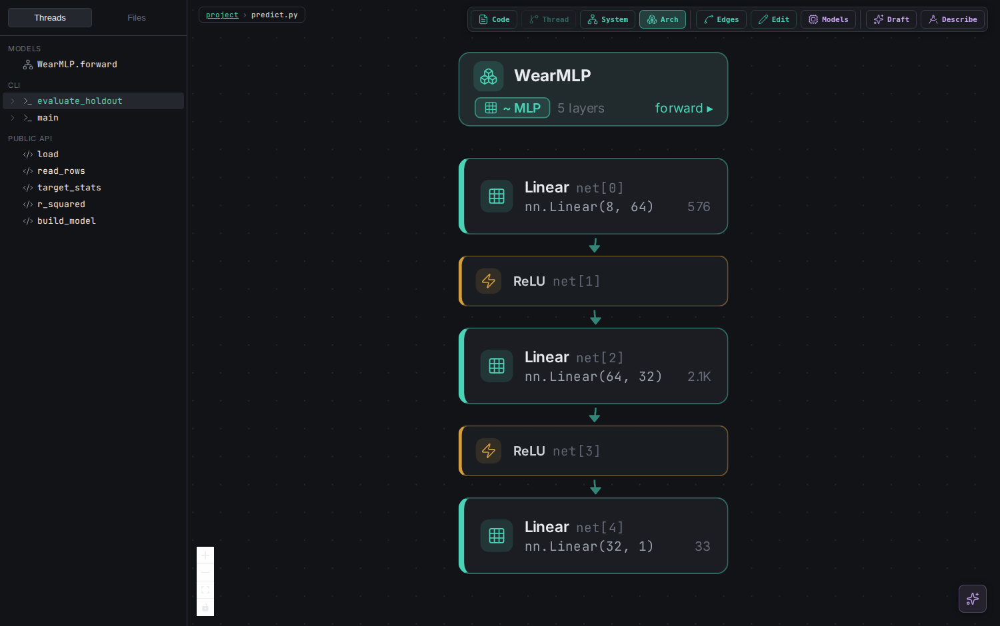
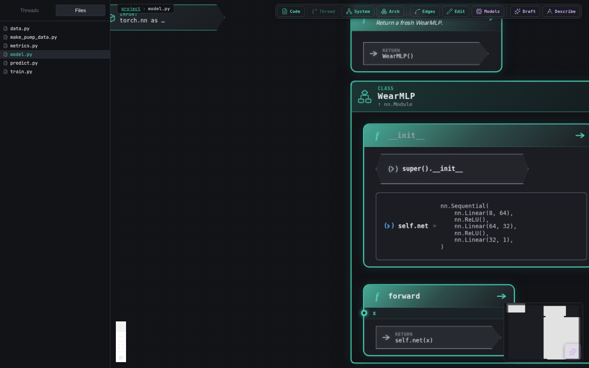

# VibeGraph

**See a codebase as the structure it really has, and give that structure, and
the rules your team knows, to Claude while it works.**

VibeGraph parses your code (Python, TypeScript, bash, C++, Rust) into an IR,
traces every entry point forward as a *thread* across files and languages, and
draws the whole system as an architecture map whose every edge names the
protocol it was read from. You can use it two ways, and they share one
`.vibegraph/` folder:

| | **Claude Code + hooks** | **The visualisation** |
|---|---|---|
| What it is | Your normal Claude Code session, with VibeGraph wired in through four hooks | A local web app: the map, threads, running and editing code, agents |
| What Claude gets | The contracts, rules and approved skills of the threads each prompt touches; every edit re-checked, a new rule violation stopped with its reason | The same, through the chat and the Agent Manager |
| Runs a server? | **No.** Every command is a local process that exits | Yes, on `127.0.0.1` only |
| Costs tokens? | No — the hooks are deterministic | Only the features that ask Claude |
| Start with | `vibegraph-knowledge init --hooks --skill` | `vibegraph-knowledge view .` |


> **Read [SECURITY.md](SECURITY.md) before pointing this at your own work.** The
> hooks path runs nothing but local commands. The visualisation can spawn the
> `claude` CLI with `--dangerously-skip-permissions`, writes to your files,
> executes your code (in a sandbox copy, behind a consent gate) and sends your
> source to Anthropic when you use its Claude features. Either way, work on a
> **git repo with a clean working tree**, so anything that changed is one
> `git diff` from review.

---

## Contents

- [Get started](#get-started) — install, the hooks, the visualisation
- [What you get](#what-you-get) — the map, threads, code, investigations, planning, software specs, agents, rules, security, direction
- [Commands and files](#commands-and-files) — every command, every file it writes
- [What it is](#what-it-is) · [Languages](#languages) · [Examples](#try-it--worked-examples) · [Development](#development) · [Limits](#limits-worth-knowing)

| Guide | |
|---|---|
| **[SETUP.md](docs/guide/SETUP.md)** | Install, check it works on an example, point it at your code, settings, troubleshooting. |
| **[VISUALISATION.md](docs/guide/VISUALISATION.md)** | The web app on your codebase: the map and its lenses, threads, running code, editing, rules, skills, agents, MCP. |
| **[CLI.md](docs/guide/CLI.md)** | Every `vibegraph-knowledge` command, the hooks, the skills, what costs tokens, a team workflow. |

## Get started

### Install — one npm package

```bash
npm install -g vibegraph-knowledge          # also installed as `vgk`; or use `npx vibegraph-knowledge …`
```

You need **Node 20+** and **Python 3.10+** (`python3` on your PATH). The first
run installs the Python parser and formatter (`libcst`, `black`) into
`~/.cache/vibegraph-knowledge` by itself. **Claude Code** (`claude`, logged in)
is optional for the visualisation and is what the hooks plug into. On Windows,
use WSL2 — and if you run Claude Code on the Windows side against a WSL project,
add `--windows` to `init --hooks` (see [SETUP.md](docs/guide/SETUP.md)).

### Claude Code, with VibeGraph in the loop (recommended)

```bash
cd /path/to/your/project
vibegraph-knowledge init --hooks --skill     # four hooks (per user, never committed) + the skills
vibegraph-knowledge export                   # .vibegraph/knowledge/: the map, one contract per thread, the rules
vibegraph-knowledge constraints add --kind invariant --files telemetry/ $ref
  --text "Operators are paged only through alerts.notify after should_notify's dedup — a flapping sensor once paged forty times a minute." $ref
  --check '{"rule":"calls-through","target":"notify","through":"should_notify"}'
```

Then start Claude Code as usual. From the **next** session:

| When | The hook | What Claude gets |
|---|---|---|
| The session starts (and after a compaction) | `SessionStart` | One orientation: languages, entry points, every stated rule in a line |
| You send a prompt | `UserPromptSubmit` | The contract, stated rules and approved skills of the threads the prompt names — once per session each, capped so it never spills into a file |
| Claude edits (including through Bash) | `PostToolUse` | Every stated rule re-checked; a **new** violation stops the edit with the rule, its reason and the offending call |
| The turn ends | `Stop` | One last check before Claude says it is done |


**Measured** (one sample each, Opus, the same task on a codebase with rules
the code does not show): with the
rules only on disk, Claude never opened them and broke one (6/7). With the
hooks it kept all seven, in **163 s for $1.19**, where the orchestrated
Agent Manager needed 2,346 s and $12.08 for the same result.

`init --skill` also installs five Claude Code skills. A skill costs about 100
tokens until a task matches it:

| Skill | For | Opens |
|---|---|---|
| `/vibegraph` | setting it up, stating rules, a blocked edit | `init`, `export`, `constraints`, `check` |
| `/vibegraph-plan` | a change whose blast radius is unclear | `export --task` → `plan.md`, `brief`, the rules and stack, `affected` |
| `/vibegraph-debug` | a failure whose cause is not in the file you are in | the thread index, `flows.md`, `brief`, where static knowledge ends |
| `/vibegraph-security` | a security review or threat model | `dataflow`, what leaves the project, trust groups, configuration |
| `/vibegraph-review` | before committing, or reviewing a diff | `check --uncommitted`, `affected`, `brief`, `dataflow` |

### The visualisation

```bash
vibegraph-knowledge view /path/to/your/project     # then open http://localhost:4200
vibegraph-knowledge view . --open                  # or open the browser for you
```

Ctrl-C stops it. Walked through in
[docs/guide/VISUALISATION.md](docs/guide/VISUALISATION.md).

### From a clone (to work on VibeGraph itself)

```bash
git clone https://github.com/BjaminA/vibegraph.git
cd vibegraph && npm install
./runVis.sh /path/to/your/project            # the same app, built from source
```

## What you get

Every picture below is the real app on a real fixture, regenerated by
`./scripts/docs_screenshots.sh`.

### The architecture map

One page of the whole system: processes, dispatchers and the tools they reach,
every edge labelled with a protocol read from a fact in the code. Lenses change
what is drawn, never what is true: *Bird's-eye*, *Overview*, *Tools*, *Flows*,
*Payloads*, *Trust*, *Configuration* and *Journeys*. Deployment and trust
groups are proposed by Claude, must cite what they were shown, and apply only
when you ratify them.

| Configuration: which process reads which environment variables | Journeys: which page links to which (Next.js) |
|---|---|
|  |  |

### Threads

Every entry point (route, CLI, script, test, page, MCP tool) traced forward
across files and languages. The list nests a sub-thread under the thread that
starts it. On the canvas, **Primary / + Secondary / All** decides how much is
drawn. Primary is what the thread does: the calls that leave your code, and the
steps on the way to them. Nothing is thrown away; a card shows **+N** for what
it hides. The **tested · N** and **env · N** chips list the tests that reach
the thread and the configuration it reads.


| The thread list, nested | + Secondary, with the configuration chip open |
|---|---|
|  |  |

`dynamic` (genuine runtime dispatch) and `unresolved` (VibeGraph could not
find the target) are drawn differently and never merged. **Run to here** runs
the real code to one node in a throwaway copy; **Observe** and **trace** record
what a dynamic call really called.

### Code and files

The code view carries the same knowledge beside the source: a gutter bar for
each line a thread reaches, coloured by rank; a dot on each line that reads an
environment variable (amber when the project declares it nowhere); code no
entry point reaches dimmed, with the reason on hover. In **Files**, unreached,
partly parsed and changed-since-export files are marked.


### Investigation board

Pin nodes from every thread a bug crosses, write the question and a note on
each, then **Hand off**: a Markdown document with each pin's code as it is now,
saved under `.vibegraph/investigations/`, carried by every export and readable
over MCP.


### Planning: a hypothetical project beside the real one

Design a project or a feature before it exists. You and Claude write the
plan together in `.vibegraph/plan.json`. It holds:

- the **objective**, in one line;
- planned **processes**, **stack**, **data boundaries**, **primary threads**
  and **rules**;
- **open questions**.

A plan is kept apart from the real knowledge and treated differently:

- **Kept small.** Hard caps on every section are enforced: a plan that
  outgrows them is refused, not trimmed. Every process and thread must say
  which part of the objective it serves.
- **Claude proposes; you agree.** Everything Claude adds arrives
  **proposed**, and Claude editing something you agreed sends it back to
  proposed. Only you agree, drop, close the plan, or **promote** a planned
  rule into `constraints.json`. The **objective** is yours alone: if Claude
  proposes a new one, it waits as an open question, which you can **Adopt**.
- **Drawn as a ghost.** On the architecture map it appears dashed, alone
  (**Plan**) or over the real map showing only what the code lacks yet
  (**Overlay**).
- **Rules are advice.** A planned rule is checked against the code but
  blocks nothing until you promote it.
- **Measured against the code.** As code lands, `plan check` (and the Plan
  panel) marks each item **realised**, **drifted** (with how) or **not
  built**, with no tokens spent. The plan becomes a spec the code is checked
  against, not a document that goes stale.
- **Kept on the objective.** A process or thread whose `serves` shares no
  word with the objective is flagged "serves the objective?". This is a
  word-match guess and says so, never a verdict.

A hooked Claude Code session receives the full plan once per session, and
after that only what changed. Every other prompt gets a single line with the
objective and what's waiting on you (about 60 tokens), so the objective never
scrolls out of sight.


| Plan: the hypothetical project alone | Overlay: the real map, plus what is not built yet |
|---|---|
|  |  |

```bash
vibegraph-knowledge plan init "Operators see every pump's wear forecast within a minute of a reading"
# …ask Claude to propose the processes, stack, boundaries and primary threads…
vibegraph-knowledge plan show                 # the plan, objective first
vibegraph-knowledge plan agree threads "POST /readings"
vibegraph-knowledge plan check                # realised / drifted / not built
vibegraph-knowledge plan promote p1           # a planned rule becomes a real, checked one
```

### Building on a specific tool: software specs

Give VibeGraph the documents of the software you're building on, such as a
platform SDK, a database or an API. It turns them into a small spec,
`.vibegraph/software/<tool>.json`, holding:

- what the tool is;
- how to recognise it in code (its packages and API names);
- its **operations**, and what each reads or writes;
- the **states** its things move through, or the **options** to choose
  between;
- the **permissions** it needs;
- its **rules**, each with the reason it exists. Up to 30 are kept, and a
  hooked session is always sent the 8 marked **core**;
- the **unknowns**: questions the docs don't answer, sent to sessions as "do
  not assume".

Every item quotes the documents it came from, or says it doesn't: INFERRED
means the drafting model's own; STATED means yours.

- **The citation gate.** One model call drafts the spec. A quote that isn't
  in the documents gets its item dropped. An item with no quote is kept but
  labelled **INFERRED**, so you can see what came from the model's own
  knowledge. A draft is used nowhere until you **ratify** it, and
  ratifying re-checks every quote against the saved documents.
- **What a ratified spec does:**
  - The stack index recognises the tool by the role its docs give it.
  - A hooked session gets the spec once, with the calls this code makes into
    it.
  - `software plan <tool>` puts its rules into the plan, each quoting its
    source.
  - `plan draft --from <docs>` drafts the architecture with the tool in mind,
    under the same citation gate.
- **Checks on the tool's own API.** A spec rule's check can target that API
  directly. `*.get_blob` means "that method on any receiver", and the
  project's own names are filled in from `--param`. So "wait for READY
  before reading a blob" becomes a check that names the one function reading
  without waiting.

```bash
vibegraph-knowledge software add synapse --from https://volt4.ai/en/concepts/synapse   # one model call; a DRAFT
vibegraph-knowledge software show synapse       # every item beside its quote; INFERRED = not in the docs
vibegraph-knowledge software ratify synapse     # quotes re-checked, then used everywhere
vibegraph-knowledge software plan synapse --param wait_ready=waitForReady
vibegraph-knowledge plan draft --from docs/brief.md   # the architecture, drafted with the spec in mind
vibegraph-knowledge software rule add synapse --text "…" --why "…" --core   # your own knowledge, marked STATED
vibegraph-knowledge software unknown add synapse --question "Is $ref supported?"
vibegraph-knowledge software edit synapse       # the whole spec in $EDITOR; every quote re-checked on save
```

**Some steps are yours alone:** agreeing, promoting, ratifying, setting the
objective, and taking the hooks out. When Claude Code runs these commands
itself (it marks them with `CLAUDECODE=1`), they're refused and the message
says where to do them: your own terminal, or the Plan panel. Everything else
it runs is recorded as Claude's.

### The Agent Manager

The Agent Manager opens on **Claude Code + hooks**, the arrangement measured
above. It runs one session with the hooks injected for that run only, and
snapshots the project first. When the session ends, the server collects the
evidence itself: every changed file, the stated rules before and after, and the
tests that reach the change. Claude's summary is labelled as a self-report.
**Accept** keeps the change; **Reject** restores the snapshot byte for byte.
The earlier orchestrated engine is one toggle away.


*Captured with the stub model the end-to-end test uses; the hooks it ran and
the block they raised are real.*

### Rules that are checked, not just written

A stated rule can carry a check VibeGraph runs against the IR: `callers-only`,
`import-only`, `calls-through`, `payload-keys`, `guards`, `not-in-loop`,
`handles-failure`, `annotated` or `co-changes`. Each check has three verdicts:
**pass**, which says what it could not follow; **violated**, which names the
call; and **unverifiable**, which is never counted as a pass. Stack policies
(*forbid*, *replace-with*) are checked the same way.


### Untrusted input

`vibegraph-knowledge dataflow` follows request data, command-line arguments,
stdin and script arguments by name into shell strings, SQL query text and
`eval`. Each finding names the source, the path and the sink call. A condition
that mentions the value turns it into *review*; it is never counted as proof.
The same findings appear in `security.md`, in each thread's contract, and in
the post-edit hook when an edit adds one. That hook only advises; it never
blocks. Name-based, and it says what it cannot see.


### Generic direction

Six coding skills (boundary integrity, change coupling, failure visibility,
repetition cost, resolvability, retry root cause). Each rule in them carries
its reason and the check that backs it. Every skill is off by default. When
one is on, the hooks send its rule headlines once per session, or only a
rule's reason when its check fires, or nothing. The full text is always
available on demand (`direction <skill>`). The panel shows where each skill
applies.


### Other views

| Arch: PyTorch models as layer schematics | Diagram: one file as structure |
|---|---|
|  |  |

## Commands and files

### Every command

`vibegraph-knowledge <command> [<project>]` — the project defaults to the
current directory. **Tokens** means the command asks a model (your `claude`
CLI) and says so; everything else is deterministic.

**Set up**

| Command | What it does | What it writes | Tokens |
|---|---|---|---|
| `init [--print]` | Points Claude Code at the knowledge folder | a marked block in `CLAUDE.md`; a line in `.gitignore` | — |
| `init --hooks [--windows]` / `--remove-hooks` | Installs (removes) the four Claude Code hooks; `--windows` writes them as `wsl.exe` commands for a Windows-side Claude | `.claude/settings.local.json` (per user, never committed) | — |
| `hook install [--target posix\|wsl] [--remove]` | The same hooks without the `CLAUDE.md` block; `--target wsl` = `--windows` | `.claude/settings.local.json` | — |
| `hook run <event> --file <path>` / `--command "<sh>"` / `--prompt "<text>"` | Fires a hook by hand: builds the payload Claude Code would send; the hook's exit codes (0, or 2 blocked) | nothing (a session record under `~/.cache`) | — |
| `doctor` | Are the hooks installed, runnable from this side, and have they fired since installed? exit 0 / 1 | nothing | — |
| `init --skill [--user]` / `--skills plan,…` / `--remove-skill` | Installs (removes) `/vibegraph` and the four task skills | `.claude/skills/`, or `~/.claude/skills/` with `--user` | — |
| `view [<path>] [--port n] [--open]` | Starts the visualisation until Ctrl-C | `.vibegraph/` state, as you use the app | only the app's Claude features |

**Know the code**

| Command | What it does | What it writes | Tokens |
|---|---|---|---|
| `export` | Derives everything and writes it for Claude | `.vibegraph/knowledge/` (see the files table) | — |
| `export --task "<text>"` | …plus the task mapped onto the threads that own it, dependencies first | `plan.md`, `plan.json` | — |
| `export --architecture` / `--with-ir` / `--archify` | …plus the map as data and a picture / the raw IR / Archify's schema | see the files table | — |
| `brief <entry> [--max n]` | One thread: its contract, then the verbatim source of its primary functions, then secondary within a budget | nothing | — |
| `affected <file>… [--uncommitted]` | The tests that reach the changed files, and the threads the change touches | nothing | — |
| `coverage <file>…` | Per file: parsed fully?, what reaches and tests it, unreached functions and why, env vars read, changed since the export | nothing | — |
| `dataflow [--json]` | Untrusted input → shell / SQL text / eval, with the path; exit 1 on an unguarded flow | nothing | — |
| `architecture` | Writes the system map | `.vibegraph/architecture-map/` | — |

**State and check what the code cannot show**

| Command | What it does | What it writes | Tokens |
|---|---|---|---|
| `check [--uncommitted \| --git <range>]` | Every stated rule's check: PASS / VIOLATED (names the call) / UNVERIFIABLE; exit 0 / 1 / 2 | nothing | — |
| `constraints list \| add \| remove \| ratify` | The stated rules, their reasons, scopes and checks | `.vibegraph/constraints.json` | — |
| `constraint show \| edit \| propose \| accept \| reject <id>` | A rule's history; change it in place (a person), or propose a change with `--why` (an agent, or anything run inside Claude Code) for a person to accept | `.vibegraph/constraints.json` | — |
| `seed(s) list \| add \| remove` | Entry points discovery cannot see (most programs are found from `package.json` and `listen` / `argv` / top-level `await`) | `.vibegraph/manual_seeds.json` | — |
| `skills list \| ratify \| reaffirm \| auto-reaffirm` | Per-thread skills: approve, re-stamp a still-correct stale one | `.vibegraph/thread-skills/` | — |
| `skills draft <entry>… \| --missing` | Drafts per-thread guidance through the grounding gates (reads the thread's lessons) | `.vibegraph/thread-skills/` | **yes** |
| `direction [<skill>]` / `enable \| disable <skill>` / `hooks headlines \| on-violation \| off` | The generic coding skills: where they apply, one skill in full, whether the hooks send them | `.vibegraph/skills.json` | — |
| `lessons list` | Rules sessions broke and put right, with the fix | nothing | — |
| `plan init "<objective>"` / `show` / `check` | A hypothetical plan: start it, read it, measure the code against it (realised / drifted / not built) | `.vibegraph/plan.json` (init) | — |
| `plan edit '<op>'` / `agree` / `drop` / `close` / `reopen` | Change the plan by small operations, each one a changelog line (a `rename` op carries every reference; a thread's `entryPoint`, a tool's `via`); `--as agent` records a proposal | `.vibegraph/plan.json` | — |
| `plan promote <rule>` | Copy a planned rule into the stated rules, where it is checked and may block | `.vibegraph/constraints.json`, `plan.json` | — |
| `plan review [--agree \| --reject <s:id,…>]` | Every pending proposal on one page — a diff against what was agreed, its evidence; decide several at once | `.vibegraph/plan.json` | — |
| `plan affected [--uncommitted]` / `plan layers [--apply]` | Plan items a change touches (and names now gone) / each module's layer rule from today's imports | nothing / `plan.json` | — |
| `docs add \| list \| check \| remove` | Generated documents and the commit since which each is stale | `.vibegraph/docs.json` | — |
| `topology add \| run \| check \| show` | The DECLARED topology — stores, zones, principals, grants, decision structures — from the project's own generator | `.vibegraph/topology/` | — |
| `topology who-writes \| can-write \| touches \| explain \| live \| trace` | Ask it; diff it against a read-only live inventory; replay a run log against it | nothing (`live`/`trace --save` keep a copy) | — |
| `plan draft --from <url\|file>…` | Draft plan items from documents and the ratified software specs; a quote not in them drops the item; all proposed | `.vibegraph/plan.json` | **yes** |
| `software add <tool> --from <url\|file>…` | Draft a spec for a tool from its own documents, behind the citation gate; saved as a draft | `.vibegraph/software/` | **yes** |
| `software list` / `show <tool> [--usage]` / `ratify <tool>` / `remove <tool>` | The specs; one with every quote and where the code calls it; accept one (quotes re-checked) | `.vibegraph/software/` | — |
| `software edit <tool>` / `rule add\|update\|remove <tool>` / `unknown add\|remove <tool>` | Change a spec: every quote re-checked, your items marked STATED; your edit keeps it ratified, a model's sends it back to draft | `.vibegraph/software/` | — |
| `software plan <tool> [--param name=value]` | Put a ratified spec's tool and rules into the plan, proposed, with the project's names filled in | `.vibegraph/plan.json` | — |
| `architecture --propose \| --modify "<text>"` | Deployment / trust groups and a start-here path, every item citing what it saw; stored pending | `.vibegraph/architecture.json` | **yes** |
| `architecture --ratify \| --reject` | Makes the pending proposal stated / drops it | `.vibegraph/architecture.json` | — |
| `classify [--dry-run \| --apply]` | The role of tools no table knows; `--apply` stores each as a model-stated policy | `.vibegraph/constraints.json` | **yes** |
| `--version` / `--help` | The version / every command and option | nothing | — |

### Every file VibeGraph makes

All of it lives under `.vibegraph/` in **your** project (plus the `init`
block in `CLAUDE.md`, and the hooks and skills under `.claude/`). **Derived** =
read from the code, regenerated at will; **stated** = a person's decision
(commit it); **proposed / drafted** = a model's, until a person ratifies it;
**observed** = what a consented run saw; **planned** = hypothetical, what we
intend to build — it will change, and it is never mixed into the rest.

**For Claude — `.vibegraph/knowledge/`** (`export`; regenerate, don't commit)

| File | Kind | What it holds | Use |
|---|---|---|---|
| `README.md` | derived | the index and reading order; what was skipped or could not be parsed | Claude reads it first |
| `architecture.md` | derived + stated | the whole system on one page: start-here story, where each process runs, what each calls and hops to (protocol and why), payloads, trust crossings | orient before a task that crosses processes |
| `constraints.md` | stated | the rules and their reasons, with who stated each | the requirements the code cannot show |
| `threads/INDEX.md`, `threads/<entry>.md` | derived + stated | one **contract** per thread: data in/out, what leaves the project and through which tool, round trips in loops, tests, configuration, untrusted input, neighbouring threads, the rules routed to it | what to keep true when editing that path |
| `flows.md` | derived | end-to-end chains, page → component → call → script, with a reverse index | everything a change touches downstream |
| `security.md` | derived | untrusted input reaching a shell, SQL text or eval, each with its path, and what the pass cannot see | a security review; before exposing an entry point |
| `design.md` | planned | when a plan exists: the hypothetical design, objective first, every item's status and its verdict against the code | keep work on the objective; see what is not built yet |
| `software/<tool>.md` | stated | each ratified software spec: operations, states, permissions, rules, every item beside its quote, and where this code calls it (drafts withheld, named) | build with the tool's own rules in mind |
| `reachability.md` | derived | the functions no entry point reaches, each with why | before calling anything dead |
| `configuration.md` | derived | the environment variables the code reads, on which threads, and which are declared nowhere | before deploying |
| `system_spec.md` | derived + stated | the tools the project is built on, by role; the modules that wrap them; policies about them | use the existing tools and wrappers |
| `skills/<entry>.md` | drafted, ratified | per-thread guidance a person approved (drafts and stale ones withheld, named) | how to work on that thread, and why |
| `investigations/` | stated | the investigation boards, as hand-off documents | pick up a bug where a person left it |
| `observations.json` | observed | what consented trace runs saw at each call site | resolve calls static analysis could not |
| `sources.json` | derived | a hash of every source file as the export read it | `coverage` says what changed since |
| `plan.md`, `plan.json` | derived | with `--task`: the task as packets on the threads that own it | order the work |
| `architecture.vibegraph.json`, `architecture.html` | derived + stated | with `--architecture`: the map as data (every lens) and as a picture | tools / people |
| `ir/`, `envelope.json`, `stack.json`, `crossings.json`, `security.json`, `quality/` | derived | with `--with-ir`: the raw IR and indexes | tools, audits, your own scripts |

**State you own — `.vibegraph/`** (commit the first three to share them with your team)

| File | Kind | What it holds | Written by |
|---|---|---|---|
| `constraints.json` | stated | the rules, their reasons, scopes and checks; stack policies | `constraints`, `classify --apply`, the app |
| `architecture.json` | stated / proposed | deployment and trust groups, names, the start-here path; a pending proposal | `architecture`, the app |
| `manual_seeds.json` | stated | entry points you named | `seeds`, by hand |
| `thread-skills/` | drafted → ratified | per-thread skills with their freshness stamp | `skills`, the app, MCP |
| `skills.json` | stated | which generic skills are on, and what the hooks send | `direction`, the app |
| `plan.json` | planned | the hypothetical plan: objective, processes, stack, boundaries, primary threads, rules, questions, changelog (replaces `system-plan.json`, which is read and converted) | `plan`, the Plan panel, MCP (proposals) |
| `software/<tool>.json`, `software/sources/` | drafted → ratified | software specs, and the document text their quotes are checked against | `software`, the Plan panel (ratify) |
| `investigations/` | stated | investigation boards: pins, the question, notes | the app |
| `observations.json` | observed | trace-run results per call site | the app's Trace / Observe |
| `models.json` | stated | which model — or local Ollama — runs which kind of work | the app's Models panel |
| `hooked-run.json`, `work-run.json`, `work-snapshots/` | runtime | an Agent Manager run's state, and the snapshot a reject restores | the app |
| `.gitignore` | — | keeps the copies of code and runtime data above out of git | VibeGraph |

**Outside the project** — `~/.cache/vibegraph-knowledge/`: the Python parser,
the envelope cache the hooks read through (only changed files are re-parsed),
per-session hook state, and **lessons** (a blocked violation that was fixed,
with the fix). Clearing the cache clears them; the hooks write nothing into
your project.

## What it is

Most code visualisers generate a picture that goes stale the moment you edit,
and you cannot edit *through* it. In VibeGraph **the file on disk is the
single source of truth and every view is a live projection of it.** Edit in
the graph and a CST patch changes the file; edit the file in your own editor
and a watcher re-derives the views within a few hundred milliseconds.

```
source files ──parse──▶ IR {nodes, edges, symbolIndex} ──▶ threads · map · contracts · checks · hooks
     ▲                                                                   │
     └────────────── CST patch (format-and-diff confined) ◀──────────────┘
```

- **Node ids are structural paths**, never line numbers
  (`module/Shape.class/area.fn/return@0`), so a selection, a skill or a rule
  survives an edit.
- **Every edit routes through one chokepoint.** A save, a chat rewrite, an
  agent's change — each becomes a CST patch, is formatted, and is diffed
  against the original. **If the diff touches a line outside the node being
  edited, it is rejected and nothing is written.**
- **Uncertainty is typed, not flattened.** A call that is genuine runtime
  dispatch reads `dynamic`; one VibeGraph could not resolve reads
  `unresolved`; a check that could not follow something says
  *unverifiable*. **You should never have to guess whether what you are
  looking at is true.**
- **The model is a guest, not the engine.** Parsing, linking, threads, the
  map, the checks and the hooks are deterministic. Claude drafts and
  converses; everything it proposes lands behind a human gate.

## Languages

| Language | Read | Edit | Run a node / trace |
|---|---|---|---|
| Python | yes | yes | yes / yes |
| TypeScript (`.ts` `.tsx` `.mjs` `.cjs`) | yes | yes | — |
| Bash (`.sh`, `#!` scripts) | yes | yes | — / yes, with nothing external executed |
| C++ | yes | yes (clang-format if installed) | — |
| Rust | yes | yes (rustfmt if installed) | — |

Plain `.js`/`.jsx` are not parsed yet. Anything skipped is counted and
reported, never dropped silently.

## Try it — worked examples

| | |
|---|---|
| [**examples/fleet-telemetry**](examples/fleet-telemetry/README.md) | Four languages and rules the code does not reveal — the example the measured runs and most screenshots above use. |
| [**examples/pump-wear**](examples/pump-wear/README.md) | A finished PyTorch project: threads, the schematic, three run-to-here drills, chat edits, skills, agents. |
| [**examples/pump-from-scratch**](examples/pump-from-scratch/README.md) | The same project built from an empty folder through ratified plans and gated increments. |
| [**examples/pump-polyglot**](examples/pump-polyglot/README.md) | pump-wear plus a Flask API, a TypeScript dashboard, a bash pipeline and a C++ tool. |

## Development

```bash
npm run build                 # web app + server bundle
npm run build:cli             # the vibegraph-knowledge bundle + vendored parsers
npm run test:ir               # the Python parser snapshot
npm run test:hooks            # the hooks, end to end
npm run test:cli-files        # the node commands, end to end
./scripts/docs_screenshots.sh # regenerate the pictures in this README
```

`npm test` is one chain that stops at the first red script. To see every
failure, run the `test:*` scripts one by one.

```
server.ts                    WebSocket runtime + MCP server (one process)
scripts/                     the Python parser and rewriter, the thread extractor,
                             the effect floor, tree-sitter frontends, the CLI and hooks (scripts/cli/)
src/server/                  stack, crossings, contracts, constraints, data flow, architecture, agents
src/webview/                 React + React Flow + Monaco
schemas/                     the IR, project and system-map contracts
packages/knowledge/          the vibegraph-knowledge package
examples/                    worked examples
test/                        fixtures, snapshots, Playwright specs
```

## Limits worth knowing

- **Static tracing has honest gaps.** Runtime dispatch, an unannotated
  receiver, or a call through a value is marked `dynamic` or `unresolved`
  rather than guessed. Trace runs fill some of them with what really ran.
- **A green check proves self-consistency, not correctness.** A builder given
  a vague data format invents one and checks against its own invention.
  Specify formats, not just field names.
- **The data-flow pass is a lead, not an audit.** It follows names; a value
  through a container, a callback or a database round trip is not followed,
  and no findings is not a clean bill.
- **C++ and Rust can be edited but not run.** Running a compiled language
  needs a build and its own consent story.
- **The server has no authentication.** It binds to `127.0.0.1`, refuses
  other web pages (Origin / Host checks), and should stay there.

## Security

See [SECURITY.md](SECURITY.md): what VibeGraph does on your machine, what
protects you (the edit chokepoint, the effect floor, human gates, the local
guard), which features send code to Anthropic, the dependency audit, and what
does not protect you.

## License

MIT — see [LICENSE](LICENSE).
