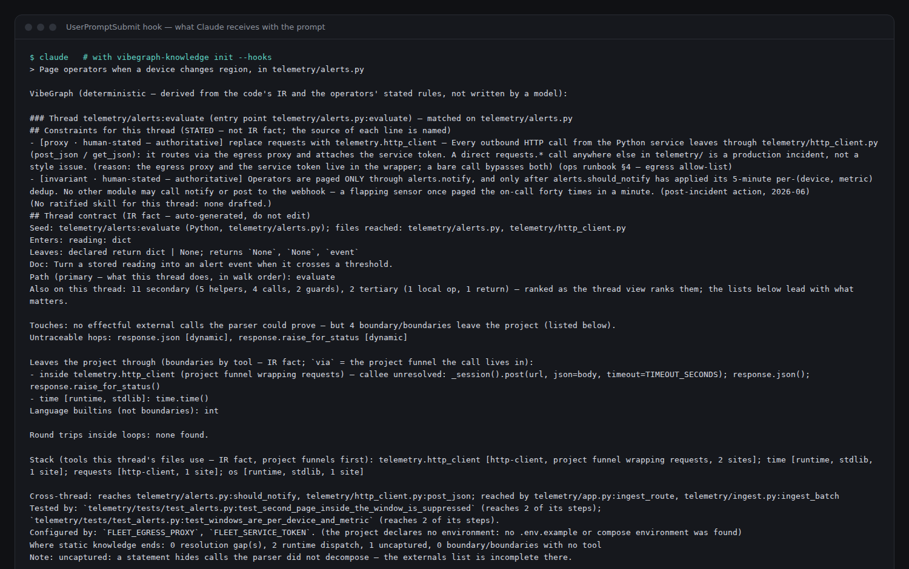
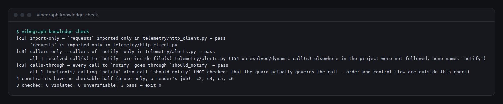
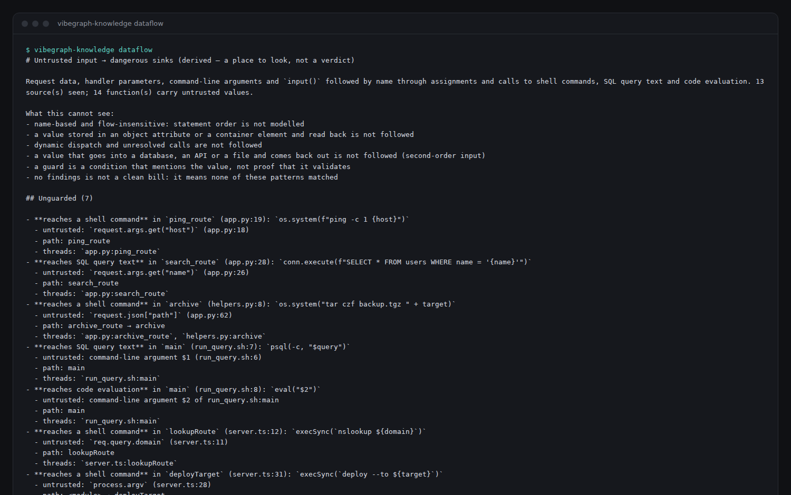

# The node commands: `vibegraph-knowledge`

`vibegraph-knowledge` (also installed as `vgk`) writes what VibeGraph derives
from your code, and what you and your team have stated about it, into
`.vibegraph/knowledge/` — plain files a Claude Code session reads before it
edits. It also verifies your stated rules against the code. These commands
need no browser, no server, and — apart from three clearly marked ones — no
model calls. The same package also runs the **visualisation**:
`vibegraph-knowledge view <project>` (see [`view`](#view--the-visualisation)).

Why it exists: in measured head-to-head runs, a plain Claude session that
could read the project's **stated rules** wrote code that kept them, and one
that could not broke them — while scoring the same on the task itself. The
rules are not in the code; this puts them, and the map of the code, where
Claude looks.

Install it (Node 20+ and Python 3.10+ on your PATH):

```bash
npm install -g vibegraph-knowledge       # or: npx vibegraph-knowledge <command>
```

More in [SETUP.md §2](SETUP.md#2-install--one-npm-package).

---

## Reference

### Every command

`vibegraph-knowledge <command> [<project>]` — the project defaults to the
current directory. **Tokens** means the command asks a model (your `claude`
CLI) and says so; everything else is deterministic.

**Set up**

| Command | What it does | What it writes | Tokens |
|---|---|---|---|
| `init [--print]` | Points Claude Code at the knowledge folder | a marked block in `CLAUDE.md`; a line in `.gitignore` | — |
| `init --hooks [--windows]` / `--remove-hooks` | Installs (removes) the four Claude Code hooks; `--windows` writes them as `wsl.exe` commands for a Windows-side Claude | `.claude/settings.local.json` (per user, never committed) | — |
| `init --skill [--user]` / `--skills plan,…` / `--remove-skill` | Installs (removes) `/vibegraph` and the four task skills | `.claude/skills/`, or `~/.claude/skills/` with `--user` | — |
| `view [<path>] [--port n] [--open]` | Starts the visualisation until Ctrl-C | `.vibegraph/` state, as you use the app | only the app's Claude features |

**Know the code**

| Command | What it does | What it writes | Tokens |
|---|---|---|---|
| `export` | Derives everything and writes it for Claude | `.vibegraph/knowledge/` (see the files table below) | — |
| `export --task "<text>"` | …plus the task mapped onto the threads that own it, dependencies first | `plan.md`, `plan.json` | — |
| `export --architecture` / `--with-ir` / `--archify` | …plus the map as data and a picture / the raw IR / Archify's schema | see the files table | — |
| `brief <entry> [--max n]` | One thread: its contract, then the verbatim source of its primary functions, then secondary within a budget | nothing | — |
| `affected <file>… [--uncommitted]` | The tests that reach the changed files, and the threads the change touches | nothing | — |
| `coverage <file>…` | Per file: parsed fully?, what reaches and tests it, unreached functions and why, env vars read, changed since the export | nothing | — |
| `dataflow [--json]` | Untrusted input → shell / SQL text / eval, with the path; exit 1 on an unguarded flow | nothing | — |
| `architecture` | Writes the system map | `.vibegraph/architecture-map/` | — |

**State and check what the code cannot show**

| Command | What it does | What it writes | Tokens |
|---|---|---|---|
| `check [--uncommitted $ref| --git <range>]` | Every stated rule's check: PASS / VIOLATED (names the call) / UNVERIFIABLE; exit 0 / 1 / 2 | nothing | — |
| `constraints list $ref| add $ref| remove $ref| ratify` | The stated rules, their reasons, scopes and checks | `.vibegraph/constraints.json` | — |
| `seeds list $ref| add $ref| remove` | Entry points discovery cannot see | `.vibegraph/manual_seeds.json` | — |
| `skills list $ref| ratify $ref| reaffirm $ref| auto-reaffirm` | Per-thread skills: approve, re-stamp a still-correct stale one | `.vibegraph/thread-skills/` | — |
| `skills draft <entry>… $ref| --missing` | Drafts per-thread guidance through the grounding gates (reads the thread's lessons) | `.vibegraph/thread-skills/` | **yes** |
| `direction [<skill>]` / `enable $ref| disable <skill>` / `hooks headlines $ref| on-violation $ref| off` | The generic coding skills: where they apply, one skill in full, whether the hooks send them | `.vibegraph/skills.json` | — |
| `lessons list` | Rules sessions broke and put right, with the fix | nothing | — |
| `plan init "<objective>"` / `show` / `check` | A hypothetical plan: start it, read it, measure the code against it (realised / drifted / not built) | `.vibegraph/plan.json` (init) | — |
| `plan edit '<op>'` / `agree` / `drop` / `close` / `reopen` | Change the plan by small operations, each one a changelog line; `--as agent` records a proposal | `.vibegraph/plan.json` | — |
| `plan promote <rule>` | Copy a planned rule into the stated rules, where it is checked and may block | `.vibegraph/constraints.json`, `plan.json` | — |
| `plan draft --from <url$ref|file>…` | Draft plan items from documents and the ratified software specs; a quote not in them drops the item; all proposed | `.vibegraph/plan.json` | **yes** |
| `software add <tool> --from <url$ref|file>…` | Draft a spec for a tool from its own documents, behind the citation gate; saved as a draft | `.vibegraph/software/` | **yes** |
| `software list` / `show <tool> [--usage]` / `ratify <tool>` / `remove <tool>` | The specs; one with every quote and where the code calls it; accept one (quotes re-checked) | `.vibegraph/software/` | — |
| `software edit <tool>` / `rule add\|update\|remove <tool>` / `unknown add\|remove <tool>` | Change a spec: every quote re-checked, your items marked STATED; your edit keeps it ratified, a model's sends it back to draft | `.vibegraph/software/` | — |
| `software plan <tool> [--param name=value]` | Put a ratified spec's tool and rules into the plan, proposed, with the project's names filled in | `.vibegraph/plan.json` | — |
| `architecture --propose $ref| --modify "<text>"` | Deployment / trust groups and a start-here path, every item citing what it saw; stored pending | `.vibegraph/architecture.json` | **yes** |
| `architecture --ratify $ref| --reject` | Makes the pending proposal stated / drops it | `.vibegraph/architecture.json` | — |
| `classify [--dry-run $ref| --apply]` | The role of tools no table knows; `--apply` stores each as a model-stated policy | `.vibegraph/constraints.json` | **yes** |
| `--version` / `--help` | The version / every command and option | nothing | — |

### Every file VibeGraph makes

All of it lives under `.vibegraph/` in **your** project (plus the `init`
block in `CLAUDE.md`, and the hooks and skills under `.claude/`). **Derived** =
read from the code, regenerated at will; **stated** = a person's decision
(commit it); **proposed / drafted** = a model's, until a person ratifies it;
**observed** = what a consented run saw; **planned** = hypothetical, what we
intend to build — it will change, and it is never mixed into the rest.

**For Claude — `.vibegraph/knowledge/`** (`export`; regenerate, don't commit)

| File | Kind | What it holds | Use |
|---|---|---|---|
| `README.md` | derived | the index and reading order; what was skipped or could not be parsed | Claude reads it first |
| `architecture.md` | derived + stated | the whole system on one page: start-here story, where each process runs, what each calls and hops to (protocol and why), payloads, trust crossings | orient before a task that crosses processes |
| `constraints.md` | stated | the rules and their reasons, with who stated each | the requirements the code cannot show |
| `threads/INDEX.md`, `threads/<entry>.md` | derived + stated | one **contract** per thread: data in/out, what leaves the project and through which tool, round trips in loops, tests, configuration, untrusted input, neighbouring threads, the rules routed to it | what to keep true when editing that path |
| `flows.md` | derived | end-to-end chains, page → component → call → script, with a reverse index | everything a change touches downstream |
| `security.md` | derived | untrusted input reaching a shell, SQL text or eval, each with its path, and what the pass cannot see | a security review; before exposing an entry point |
| `design.md` | planned | when a plan exists: the hypothetical design, objective first, every item's status and its verdict against the code | keep work on the objective; see what is not built yet |
| `software/<tool>.md` | stated | each ratified software spec: operations, states, permissions, rules, every item beside its quote, and where this code calls it (drafts withheld, named) | build with the tool's own rules in mind |
| `reachability.md` | derived | the functions no entry point reaches, each with why | before calling anything dead |
| `configuration.md` | derived | the environment variables the code reads, on which threads, and which are declared nowhere | before deploying |
| `system_spec.md` | derived + stated | the tools the project is built on, by role; the modules that wrap them; policies about them | use the existing tools and wrappers |
| `skills/<entry>.md` | drafted, ratified | per-thread guidance a person approved (drafts and stale ones withheld, named) | how to work on that thread, and why |
| `investigations/` | stated | the investigation boards, as hand-off documents | pick up a bug where a person left it |
| `observations.json` | observed | what consented trace runs saw at each call site | resolve calls static analysis could not |
| `sources.json` | derived | a hash of every source file as the export read it | `coverage` says what changed since |
| `plan.md`, `plan.json` | derived | with `--task`: the task as packets on the threads that own it | order the work |
| `architecture.vibegraph.json`, `architecture.html` | derived + stated | with `--architecture`: the map as data (every lens) and as a picture | tools / people |
| `ir/`, `envelope.json`, `stack.json`, `crossings.json`, `security.json`, `quality/` | derived | with `--with-ir`: the raw IR and indexes | tools, audits, your own scripts |

**The system map — `.vibegraph/architecture-map/`** (`architecture`)

| File | What it holds | Use |
|---|---|---|
| `architecture.md` | the map as prose (as above) | read it, or hand it to an agent |
| `architecture.vibegraph.json` | every box, edge and group with its source, each lens (Bird's-eye, Overview, Tools, Flows, Payloads, Trust) as the ids it selects, the hierarchy, subsystems, thread graph — schema `schemas/system_map.schema.json` | query it from scripts or agents |
| `architecture.html` | the map, self-contained, every lens a toggle | open in any browser; share it |
| `architecture.json` | the raw architecture model | tools |
| `architecture.archify.json` | with `--archify`: the model in Archify's schema | Archify |

**State you own — `.vibegraph/`** (commit the first three to share them with your team)

| File | Kind | What it holds | Written by |
|---|---|---|---|
| `constraints.json` | stated | the rules, their reasons, scopes and checks; stack policies | `constraints`, `classify --apply`, the app |
| `architecture.json` | stated / proposed | deployment and trust groups, names, the start-here path; a pending proposal | `architecture`, the app |
| `manual_seeds.json` | stated | entry points you named | `seeds`, by hand |
| `thread-skills/` | drafted → ratified | per-thread skills with their freshness stamp | `skills`, the app, MCP |
| `skills.json` | stated | which generic skills are on, and what the hooks send | `direction`, the app |
| `plan.json` | planned | the hypothetical plan: objective, processes, stack, boundaries, primary threads, rules, questions, changelog (replaces `system-plan.json`, which is read and converted) | `plan`, the Plan panel, MCP (proposals) |
| `software/<tool>.json`, `software/sources/` | drafted → ratified | software specs, and the document text their quotes are checked against | `software`, the Plan panel (ratify) |
| `investigations/` | stated | investigation boards: pins, the question, notes | the app |
| `observations.json` | observed | trace-run results per call site | the app's Trace / Observe |
| `models.json` | stated | which model — or local Ollama — runs which kind of work | the app's Models panel |
| `hooked-run.json`, `work-run.json`, `work-snapshots/` | runtime | an Agent Manager run's state, and the snapshot a reject restores | the app |
| `.gitignore` | — | keeps the copies of code and runtime data above out of git | VibeGraph |

**Outside the project** — `~/.cache/vibegraph-knowledge/`: the Python parser,
the envelope cache the hooks read through (only changed files are re-parsed),
per-session hook state, and **lessons** (a blocked violation that was fixed,
with the fix). Clearing the cache clears them; the hooks write nothing into
your project.

---

## Quick start

```bash
cd /path/to/your/project
vibegraph-knowledge init --hooks --skill   # the hooks + the skills, a CLAUDE.md block, a .gitignore line
vibegraph-knowledge export                 # parse, derive, write .vibegraph/knowledge/
```

Open a **new** Claude Code session in the project as usual. From its first
prompt, the hooks hand Claude the contracts and rules of the code the prompt
names and re-check the rules after every edit; `CLAUDE.md` points it at
`.vibegraph/knowledge/README.md` for everything else. (Plain `init`, without
`--hooks`, only writes that pointer.)

Then add what only your team knows:

```bash
vibegraph-knowledge constraints add --kind invariant --all $ref
  --text "Every outbound HTTP call goes through lib/http_client.py: it routes via the egress proxy and attaches the service token."
vibegraph-knowledge export        # re-export whenever the rules or the code change
```

## Every command in detail

Every command takes the project root as a positional argument (it can come
last; the default is the current directory). Exit code 0 is success, 1 means
something was found or refused (the output says what), 2 is bad usage, 3 means
a model could not be run.

### `view` — the visualisation

```bash
vibegraph-knowledge view [<path>] [--port <n>] [--open]
```

Starts the web app on a project (or one file) and serves it at
<http://localhost:4200> until `Ctrl-C`. The same app `./runVis.sh` builds
from a clone, shipped prebuilt in this package. The first run installs
`libcst` and `black` 24+ into `~/.cache/vibegraph-knowledge`; `python3` must be
on your PATH. `--open` opens your browser once it is ready; `--port` (or
`PORT`) moves it. The server binds `127.0.0.1` only. What you can do in it:
[VISUALISATION.md](VISUALISATION.md). Zero tokens until you use a Claude
feature in the app.

### `init` — point Claude at the knowledge

```bash
vibegraph-knowledge init [<root>] [--print]
```

Writes one marked block into the project's `CLAUDE.md` (replaced on re-run,
never duplicated) and adds `.vibegraph/knowledge/` to `.gitignore`.
`--print` shows the block without writing. Zero tokens.

**`--hooks`** also installs four [Claude Code hooks](https://docs.claude.com/en/docs/claude-code/hooks)
in `.claude/settings.local.json` — the per-user settings file, never
committed, because the commands name this machine's node, CLI and Python by
absolute path. They run `vibegraph-knowledge hook <event>`, spend no tokens and
never write to your code:

| When | What the hook does |
|---|---|
| a session starts | an orientation: the project's languages and entry points, every stated rule in one line with its checks, the ratified skills, where the knowledge folder is. After a **compaction** (or `/clear`) it also resets what counts as already delivered — that context is gone — so contracts and rules are sent again when a prompt names their code. |
| you send a prompt | routes the prompt to the threads it names (files, symbols, node ids — the same matcher the app's chat uses) and adds each one's contract, the stated rules routed to it and its ratified skill, once per session. A prompt that names no code is matched on the code's own words (function names, file paths, docstrings) and the result is labelled a keyword guess; with no match at all it gets the project-wide rules once. |
| Claude edits a file | re-checks every stated rule against the edited tree. A **new** violation of a rule whose check may reject stops Claude with the rule, its reason and the offending call, so it fixes it on the spot. New unverifiable or advisory findings, and the tests that reach the file, are added as notes. An edit that leaves the file unparseable is stopped too. |
| Claude finishes a turn | the same check once more; a new violation keeps the turn going (at most twice, then it is reported to you instead). |



"New" means not already there at the session's first prompt: a violation
your tree already had is reported by `check`, never blocked on. Each run reads
the project through the envelope cache (below), so it costs about a second
when little changed. Everything a hook hands Claude stays under Claude Code's
10,000-character inline limit (over it, Claude Code saves the text to a file
Claude must then read); what does not fit is named and sent on a later
prompt. When a blocked violation clears, the hook records a **lesson** (the
rule, where it broke, the file's diff when it cleared) under
`~/.cache/vibegraph-knowledge`; `lessons list` shows them, and `skills draft`
hands a thread's lessons to the drafting prompt — a lesson reaches a future
session only through a skill a person ratifies. `--remove-hooks` takes out exactly these four entries
and leaves any other hook alone.

Claude Code reads hook settings when a session starts, so the hooks work
from the **next** session (you can review them with `/hooks`). Run from
`npx`, the hooks call `npx --yes vibegraph-knowledge@<that version>`
(npx's own cache is not a stable path); from a global or project install,
they call that install directly.

**`--skill`** installs the Claude Code skill `/vibegraph` into
`.claude/skills/vibegraph/SKILL.md` (with `--user`, into `~/.claude/skills/`,
for every project on the machine, and nothing else is written). It tells a
plain Claude chat how to set VibeGraph up (`init --hooks`, `export`), how to
state rules with their reasons and checks, to run `check --uncommitted`
before finishing, and what to do when a hook blocks (fix the code; never
remove the hooks or edit `.vibegraph/`; ask when the rule looks wrong).
With the skill installed machine-wide you can simply ask Claude to "set up
VibeGraph here". `--remove-skill` takes it out.

It also installs four **task skills**, each a short list of which knowledge
file and which command to open for one kind of work — the hooks already
deliver the contracts and rules of the threads a prompt names; these cover
what a hook cannot guess:

| Skill | Opens |
|---|---|
| `/vibegraph-plan` | `export --task` → `plan.md`, `brief`, `constraints.md`, `system_spec.md`, `architecture.md`, `affected` |
| `/vibegraph-debug` | `threads/INDEX.md`, `flows.md`, `brief`, "Where static knowledge ends", `affected`, `coverage` |
| `/vibegraph-security` | `dataflow` / `security.md`, "Leaves the project through", `architecture.md` trust groups, `configuration.md`, `check` — and says what it cannot see |
| `/vibegraph-review` | `check --uncommitted`, `affected`, `brief`, `system_spec.md`, `dataflow` |

Claude Code keeps only a skill's name and description in context until a
task matches it (about 100 tokens each). `--skills plan,security` installs
just those (the setup skill always comes along); `test:task-skills` fails if
a skill names a file the export no longer writes or a command the CLI no
longer answers.

**The envelope cache.** `check`, `affected`, `coverage` and the hooks keep
the last parse under `~/.cache/vibegraph-knowledge/envelopes/`, outside the
project. Nothing changed → it is read back; files changed → only those are
re-parsed and only the threads that walk them re-extracted; a new file, a
tsconfig / Cargo.toml / manual-seeds change, a different Python or a new
VibeGraph version → a full rebuild. The result is the same as a full parse
(`test:envelope-cache` compares them after every kind of edit). On a
1,128-file project `check` went from 17 s to 3 s with nothing changed and
about 8 s after an edit. `--no-cache` or `VG_NO_CACHE=1` turns it off.

### `export` — write the knowledge folder

```bash
vibegraph-knowledge export [<root>] [--task "<text>"] [--with-ir] [--architecture] [--archify] [--out <dir>]
```

Parses the project and writes `.vibegraph/knowledge/`. Zero tokens. By
default it writes **prose** — what a reader actually opens:

| File | Contents |
|---|---|
| `README.md` | the index and reading order; what was skipped, what could not be parsed |
| `constraints.md` | the stated rules, with their reasons and provenance |
| `architecture.md` | the whole system on one page: the start-here story, the system in a dozen arrows, where each process runs, what each calls and hops to (with the protocol and why), what crosses each edge, trust crossings, subsystems, which threads drive which, what the map leaves out |
| `threads/INDEX.md`, `threads/<entry>.md` | one **contract** per thread: data in and out, every external call with its literal text and the tool it leaves through, round trips inside loops, neighbouring threads, the rules routed to it |
| `flows.md` | end-to-end chains from a page to the script it runs, and a reverse index |
| `system_spec.md` | the tools the project is built on, the modules that wrap them, the policies stated about them |
| `skills/<entry>.md` | ratified, fresh thread skills (drafts and stale ones are withheld and named) |
| `security.md` | untrusted input reaching a shell, SQL text or eval, each with its path — see [`dataflow`](#dataflow--untrusted-input-to-a-dangerous-sink) |
| `reachability.md` | the functions no entry point reaches, each with why |
| `configuration.md` | the environment variables read, where, and which are declared nowhere |
| `investigations/` | investigation boards from the app, as hand-off documents |
| `observations.json` | what consented trace runs saw, when there are any |

Options:

- `--task "<text>"` also writes `plan.md` / `plan.json`: the task mapped onto
  the threads that own it, dependencies first, with each packet's files and
  what a review would check. Matching is lexical — **name the code** (files,
  backticked symbols); a task that names none says so.
- `--architecture` also writes `architecture.vibegraph.json` (the map as data:
  every record with its provenance, each lens as the ids it selects, the
  hierarchy, subsystems, thread graph; schema in
  `schemas/system_map.schema.json`) and `architecture.html` (the map for
  people, self-contained, every lens a toggle).
- `--archify` also writes `architecture.archify.json` in
  [Archify](https://github.com/tt-a1i/archify)'s schema.
- `--with-ir` also writes the raw forms: per-file IR, the envelope, stack,
  crossings, the quality profile.
- `--out <dir>` writes elsewhere (the directory must be empty or a previous
  export).

### `check` — verify the stated rules against the code

```bash
vibegraph-knowledge check [<root>] [--uncommitted | --git <range>] [--json]
```

Runs the machine-checkable half of every stated rule. Each clause reads
**PASS** (with what it could not follow), **VIOLATED** (naming the file and
the call), or **UNVERIFIABLE** — which is never counted as a pass. Exit 0 all
passed · 1 something violated · 2 nothing violated but something
unverifiable. `--uncommitted` treats your working-tree changes as the delta
(what a pre-commit hook has); `--git <range>` uses a commit range. Zero
tokens. A good pre-commit or CI step.



### `dataflow` — untrusted input to a dangerous sink

```bash
vibegraph-knowledge dataflow [<root>] [--json]
```

Follows untrusted input by name into places where it becomes code: a
shell string (`os.system`, `subprocess(..., shell=True)`, `execSync`,
`eval`/`sh -c` and a variable command word in bash), SQL query **text**
(a value passed as a separate parameter is parameterised and is not a
finding), `eval`/`exec`/`new Function`, and — as *review* — a list-form
subprocess argument. Sources: request data (`request.args`/`.json`/`.form`,
`req.body`/`.query`/`.params`, `searchParams`), route and MCP-tool handler
parameters, `sys.argv`/`process.argv`, `input()`, stdin, and a script's
`$1`…`$@`. The value is followed through assignments (destructuring
included), loops, module-level values read inside functions, and into the
parameters of the functions it is passed to, across files. `int()`,
`shlex.quote`, `escape…`, `sanitize…` clean it.

Each finding is **UNGUARDED** (nothing on the way) or **review** (an `if`
mentions the value — read it; a condition is not proof it validates), with
the source, the functions it passed through and the sink call. Exit 1 when
anything is unguarded. The same findings are `security.md` in the export, a
line in each thread contract, and — when an edit introduces a new one — an
advisory note from the post-edit hook (it never blocks). Zero tokens.

What it cannot see, and says on every report: statement order is not
modelled; a value stored in an object or container and read back, dynamic
dispatch, and a value that goes into a database or file and comes back out
(second-order input) are not followed. **No findings is not a clean bill.**
It does no secret scanning and knows no CVEs — run `npm audit` /
`pip-audit` / `cargo audit` for dependencies.



### `plan` — a hypothetical project, kept apart from the real one

```bash
vibegraph-knowledge plan init "<objective>" [--root <dir>]
vibegraph-knowledge plan show | check [--json]
vibegraph-knowledge plan edit '<op>' | --file ops.json [--as agent]
vibegraph-knowledge plan agree|drop <section> <id>
vibegraph-knowledge plan promote <rule id>
vibegraph-knowledge plan close | reopen
```

Designs a project or feature before it exists, in `.vibegraph/plan.json`.
The plan holds:

- the **objective**, one line;
- **processes** (`at`: where the code will live);
- **stack** (tools with the same roles the real stack uses);
- **boundaries** (`from` → `to`, a protocol, `carries`: key names only);
- **threads**, with PRIMARY steps only (`b1:insert` names the boundary a step
  crosses);
- **policies** (text + why, and optionally a check in the constraint
  grammar);
- **open** questions.

Zero tokens.

It is treated differently from the real knowledge:

- **Small by force.** At most 12 processes, 16 boundaries, 12 tools, 7
  threads of at most 8 steps, 10 rules and 10 questions, each a line. A plan
  that outgrows the caps is refused with the reason, never trimmed. Every
  process and thread says which part of the objective it `serves`.
- **Changed by small operations.** Each operation is one changelog line and
  bumps the revision; a batch applies whole or not at all.
  - `{"op":"add","section":…,"item":{…}}`
  - `{"op":"update","section":…,"id":…,"fields":{…}}`
  - `{"op":"drop",…}`, `{"op":"agree",…}`
  - `{"op":"set-objective","text":…}`, `close`, `reopen`
- **Claude proposes; a person agrees.** Whoever runs this command is a
  person.
  - `--as agent` (what the MCP tool `vibegraph_plan_edit` does) adds items as
    **proposed**, puts an agreed item it edits back to proposed, and cannot
    agree, close or promote.
  - **The objective is a person's.** An agent cannot start a plan, and an
    agent's `set-objective` is recorded as an open question, `Proposed
    objective: …`. A person adopts it with `set-objective` (the Plan panel's
    **Adopt** does that and drops the question).
- **Planned rules are advice.** `plan check` runs their checks through the
  same checkers as `check`, but they block nothing. `plan promote` copies one
  into `.vibegraph/constraints.json` as a human-stated rule, with its reason
  in the text. From then on `check` and the hooks enforce it.

`plan check` measures the code against the plan. Every live item gets a
verdict, with the reason:

- **realised**: the code has it.
- **drifted**: the code has something different. For example, "planned as
  db; the code reads it as cache", "not found on its thread: publish", or
  "sqlite3 is used, but not from forecaster's files".
- **not-built**: nothing in the code yet.
- **unanchored**: a process with no `at` and no directory of its name.
- **unverified**: a process-to-process hop whose two ends both exist.
- **pass / violated / unverifiable / prose**: a planned rule's check, as
  advice.

Matching is by name and path, and every report says what it cannot see: the
order of steps, payload keys, the hop between two processes. It exits 0,
because a plan never fails a run.

It also lists **possibly off the objective**: any process or thread whose
`serves` shares no meaningful word with the objective. Trailing "s", "ed" and
"ing" are ignored, and common words don't count. It's a word-match guess and
says so ("latency" can serve "within a minute" and share nothing), so it's a
prompt to look, never a verdict.

Where the plan shows up:

- **Hooked Claude Code sessions** receive the compact plan once per session,
  then only what changed. Every other prompt gets one line, about 60 tokens:
  `Plan objective (rev 7; 3 items proposed, 1 open question): … — keep this
  work on it.` Nothing is sent while the plan is closed.
- **The export** writes it as `design.md`.
- **The app** has a Plan panel, and **Plan** / **Overlay** views on the
  architecture map.
- **The greenfield flow's architecture** is the plan's agreed processes. An
  old `.vibegraph/system-plan.json` is read, and converted on the next save.

### `software` — a spec for the tool you build on, from its own documents

```bash
vibegraph-knowledge software add <tool> --from <url|file> [--from …] [--hint "…"] [--model m] [--dry-run | --reply <file>]
vibegraph-knowledge software list | show <tool> [--usage] [--json] | ratify <tool> | remove <tool>
vibegraph-knowledge software plan <tool> [--param name=value …]
vibegraph-knowledge plan draft --from <url|file> … [--dry-run | --reply <file>]
```

`software add` reads the documents you name. It fetches a URL (HTML becomes
text) or reads a file, and keeps the text under
`.vibegraph/software/sources/`. It then asks a model, in **one call that
spends tokens**, for `.vibegraph/software/<tool>.json`:

- **definition:** what the tool is;
- **identity:** the packages and API names that mean it in code;
- **operations:** each one's name, what it does (read / write / call /
  subscribe / admin) and what it acts on;
- **states**, **permissions**, and **rules** (text + why), where a rule may
  carry a check.

Every item carries `cite`, a verbatim quote from the documents.

The **citation gate** decides what the draft may keep:

- A quote that is not in the documents, after normalising whitespace, case
  and punctuation, **drops** its item.
- An item with no quote is kept and labelled **INFERRED**.
- The report lists both, and so does `show`.

`--dry-run` prints the prompt and spends nothing. `--reply` uses a saved
model reply.

A spec is a **draft** until `software ratify`, which re-checks every quote
against the saved text (a hand-edited quote is refused). A draft is used
nowhere. A ratified spec is used in these places:

- **The stack index:** the spec's packages get the spec's role (provenance
  `software:<tool>`) wherever no table knows them.
- **The hooks:** once per session, when a prompt's threads reach the tool or
  the open plan names it, with the calls this code makes into it (`This
  code calls it: get_blob (read blob) at app.py:15`).
- **The plan:** `software plan <tool>` adds the tool to the planned stack
  and its rules as planned rules. Each is proposed, quotes its source, and
  records `source: "<tool> s1"`. A check's `{placeholders}` are the project's
  own names, filled from `--param`. A rule still missing one says which
  names it needs, and carries no check until it has them.
- **Plan drafting:** `plan draft --from <docs>` (**spends tokens**) sends
  the objective, the plan so far, every ratified spec and the documents to a
  model. Its items pass the same gate (quotes may come from the documents or
  a spec's sources) and land proposed.
- **The export:** `software/<tool>.md`, with drafts withheld and named.
- **MCP:** `vibegraph_software`.

**Checks on a tool's API.** A check's target may name an external call:

- `lib.fn` matches exactly that call.
- `*.fn` matches that method on any receiver.
- A bare name still means a function of the project's own, exactly as
  before, so no existing rule changes.

For example, `{"rule":"calls-through","target":"*.get_blob","through":"wait_ready"}`
names each function that reads a blob without waiting.

What it cannot do: the gate proves an item quotes the documents, not that the
model understood them. Ratify only after reading `show`.

**What a spec holds, and how much of it a session gets.** A spec is a
reference for someone else's tool, so it may hold up to 30 rules. Each rule
is one line, and its *why* may run to 400 characters. Up to 8 rules are
marked **core**. A hooked session is sent only the core rules (or the first 8
when none are marked) and is told how many more are in the full spec. The
spec also holds:

- **states**, each either a *sequence* (DRAFT → READY) or a *choice* (map |
  array | text | blob);
- **unknowns**: questions the documents don't answer, such as a schema
  version or whether `$ref` works. Sessions are sent them as "the docs do NOT
  say — do not assume".

The citation gate also drops a rule's **check** when its target isn't one of
the tool's own operations. A check that proves less than its rule claims
gives a false pass, which is worse than no check.

**Editing a spec.** Don't edit the JSON by hand; these re-check it:

```bash
vibegraph-knowledge software edit synapse                    # the whole spec in $EDITOR
vibegraph-knowledge software rule add synapse --text "…" --why "…" [--core] [--check '<json>'] [--cite "exact quote"]
vibegraph-knowledge software rule update synapse --id s6 --why "…"      # --core / --not-core / --check null / --cite null
vibegraph-knowledge software rule remove synapse --id s15
vibegraph-knowledge software unknown add synapse --question "Is $ref supported?" --matters "splitting schemas"
```

Every edit is validated and **every quote is re-checked against the saved
documents**. If anything fails, nothing is written, and `edit` keeps your
copy for another try.

- **Marked as yours.** Items you add or change are marked `by: human` and
  read as **STATED by a person**, never as the drafting model's INFERRED.
- **Status.** Your edit keeps a ratified spec ratified. An edit made from
  Claude Code (below) sends it back to draft.
- **A record.** Each edit is one line under "Edits since drafting".
- **The plan follows.** Run `software plan synapse` again after an edit: a
  planned rule whose source rule changed is updated and goes back to
  **proposed**, because you agreed to the old words. A check you filled in
  with `--param` earlier is kept.

**Steps that are yours** (when Claude Code runs a command, it sets
`CLAUDECODE=1`, and these are refused with where to do them instead):

- `plan init`, `plan agree`, `plan close`, `plan reopen`, `plan promote`;
- `software ratify`, `software remove`;
- `constraints ratify`, `constraints remove`;
- `skills ratify`, `skills reaffirm`, `skills auto-reaffirm`;
- `architecture --ratify`, `architecture --reject`;
- `init --remove-hooks`, `init --remove-skill`.

Everything else Claude runs is recorded as **Claude's**:

- plan edits are proposals, and a new objective becomes an open question;
- `constraints add` is agent-stated;
- a spec edit sends the spec back to draft.

This is a strong speed bump, not a lock: Claude could strip the variable on
purpose. A command you type in Claude Code's own `!` shell carries the mark
too, so do your own steps in a normal terminal or the Plan panel.

### `constraints` — the rules the code cannot show

```bash
vibegraph-knowledge constraints list [<root>] [--json]
vibegraph-knowledge constraints add [<root>] --kind <kind> --text "<rule and its reason>" <scope> [--note "…"] [--check '<json>'] [--policy '<json>']
vibegraph-knowledge constraints add [<root>] --json '<whole constraint>'
vibegraph-knowledge constraints remove <id> [<root>]
vibegraph-knowledge constraints ratify <id> [<root>]
```

- **kind**: `payload-schema`, `proxy`, `backend-call`, `perf-lever`,
  `invariant`, `objective`, `stack-policy`.
- **scope** — which threads the rule is routed to: `--all`,
  `--threads <entry ids>`, `--files <paths>`, or `--tools <tool names>`
  (comma-separated).
- **`--check`** makes the rule verifiable, e.g.
  `'{"rule":"import-only","tool":"requests","files":["lib/http_client.py"]}'`
  or `'{"rule":"callers-only","target":"charge","files":["api/checkout.py"]}'`
  (only `api/checkout.py` may call `charge`), or
  `'{"rule":"calls-through","target":"notify","through":"should_notify"}'`
  (every function that calls `notify` also calls `should_notify`), or
  `rule:payload-keys`
  (every call passes those keys and never those — read from the literal
  arguments at each call site; a key hidden by a spread or a variable payload
  makes that call *unverifiable*, never violated). Targets are function names
  or callees as written.
  Rules: `callers-only`, `import-only`, `calls-through`, `payload-keys`, `guards`,
  `not-in-loop`, `handles-failure`, `annotated`, `co-changes`.
- **`--policy`** (for `stack-policy`) states a decision about a tool:
  `'{"tool":"requests","rule":"replace-with","with":"lib.http_client"}'`
  — rules `require`, `prefer`, `forbid`, `replace-with`, `describe`.

`add` records the rule as **human-stated** (you ran the command). A rule that
restates an existing one is refused as a duplicate; a malformed check is
refused rather than stored looking enforced. `ratify` turns a rule a model
stated (e.g. by `classify --apply`) into a human-stated one. Zero tokens.

Write the **why** into the text. "Region changes page the on-call once per
device per hour — a flapping sensor once paged forty times in a minute" is
what lets the next reader handle a case the rule did not foresee.

### `seeds` — entry points discovery cannot see

```bash
vibegraph-knowledge seeds list [<root>]
vibegraph-knowledge seeds add <file>[:<function|Class>] [<root>] [--note "<why>"]
vibegraph-knowledge seeds remove <file>[:<function|Class>] [<root>]
```

For code that is really an entry point but is not found as one: a helper a
scheduler calls, a script a cron line outside the repo runs. A bare `<file>`
names the file's top level. The seed is resolved against the parsed project
before it is written, and refused if it would not become a thread. Each seed
becomes a thread — and a contract — on the next export. Zero tokens.

### `skills` — per-thread guidance

```bash
vibegraph-knowledge skills list [<root>]
vibegraph-knowledge skills draft <entry id>... | --missing [<root>] [--dry-run] [--reply <file>] [--model <id>]
vibegraph-knowledge skills ratify <entry id> [<root>]
vibegraph-knowledge skills reaffirm <entry id> [<root>]
vibegraph-knowledge skills auto-reaffirm <entry id> on|off [<root>]
```

A thread skill is a short document for one thread — purpose, architecture,
steps (citing IR node ids), gotchas, and the rules routed to it *with their
reasons*.

- `list` — every thread and its skill: none, draft, ratified and fresh, or
  stale.
- `draft` — **spends tokens**: one model call per skill (plus one retry if it
  cites a node id that does not exist). The draft must cite at least one real
  node and none invented, and have its four sections, or it is not written.
  It is always a **draft**; the export withholds drafts. `--missing` drafts
  every thread without one. `--dry-run` prints the prompt only.
- `ratify` — you have read it; the next export copies it.
- `reaffirm` — the code or its rules changed, but the skill is still right:
  re-stamp it. `auto-reaffirm on` keeps a ratified skill exported across
  changes, with a caveat attached.

### `architecture` — the system map, and the groups the code cannot show

```bash
vibegraph-knowledge architecture [<root>] [--out <dir>] [--archify]
vibegraph-knowledge architecture [<root>] --propose            # spends tokens
vibegraph-knowledge architecture [<root>] --modify "<what should change>"   # spends tokens
vibegraph-knowledge architecture [<root>] --ratify | --reject
```

Without a flag: writes `architecture.md`, `architecture.vibegraph.json`,
`architecture.html` and `architecture.json` into
`.vibegraph/architecture-map/`. Zero tokens.

`--propose` asks a model for deployment and trust **groups** (hosts,
networks, trust zones), names, and a start-here path. It sees the derived
map, your deployment files read line by line (docker-compose, Dockerfile,
Kubernetes, Terraform, pm2, Procfile, systemd, `.env.example` — never `.env`)
and doc lines. Every item must cite something it was shown; a citation it
was not shown is dropped, and an uncited item is kept but marked *INFERRED*.
The proposal is stored **pending**; `--ratify` makes it stated (whoever runs
the command is the human), `--reject` drops it, `--modify` re-drafts with your
words.

Once a proposal is ratified the groups are settled: `--propose` (and the
app's button, and MCP) refuse to spend tokens on another one, and say when it
was ratified. To draft again anyway, add `--force`; or edit
`.vibegraph/architecture.json` by hand.

### `classify` — tools no table knows

```bash
vibegraph-knowledge classify [<root>] [--apply] [--dry-run] [--model <id>]
```

**Spends tokens.** For every third-party tool whose role VibeGraph's tables do
not know, it builds a dossier from how the code uses it and asks a model for
its role (database, queue, model API, platform…). `--apply` stores each answer
as an **agent-stated** policy, labelled *NOT human-reviewed* wherever it shows;
`constraints ratify <id>` makes one yours. A role you state yourself always
wins.

## A workflow for a team

```bash
# once
vibegraph-knowledge init
vibegraph-knowledge architecture --propose        # review what it cites…
vibegraph-knowledge architecture --ratify         # …then make it stated
vibegraph-knowledge constraints add …             # the rules everyone knows and the code does not say
vibegraph-knowledge seeds add scripts/nightly.sh  # anything run from outside the repo

# per area of work
vibegraph-knowledge skills draft <entry id>       # read it
vibegraph-knowledge skills ratify <entry id>

# every time the code or the rules move (or in a hook)
vibegraph-knowledge export
vibegraph-knowledge check --uncommitted           # before committing
```

Commit `.vibegraph/constraints.json`, `.vibegraph/architecture.json` and
`.vibegraph/manual_seeds.json` so the whole team — and every Claude session —
shares them. Leave `.vibegraph/knowledge/` uncommitted: it is regenerated.

## What costs tokens

Only `classify`, `architecture --propose` / `--modify`, and `skills draft`.
Each says so in `--help`, uses your `claude` CLI (or `VG_CLAUDE_BIN`), runs
with no MCP servers and no write tools, and stores what it produced as a
model's work until you ratify it. Everything else is deterministic.

## Settings

`VG_PYTHON` (the interpreter), `VIBEGRAPH_PYDEPS` (a directory already holding
`libcst`), `VIBEGRAPH_KNOWLEDGE_HOME` (where `libcst` is installed when
missing, default `~/.cache/vibegraph-knowledge`), `VG_CLAUDE_BIN` (the model
command). See [SETUP.md §6](SETUP.md#6-settings).
