# Using the visualisation on your codebase

Set-up is in [SETUP.md](SETUP.md). This page assumes you can run:

```bash
npm install -g vibegraph-knowledge            # once
vibegraph-knowledge view /path/to/your/project
```

and open <http://localhost:4200>. (From a VibeGraph clone, `./runVis.sh
/path/to/your/project` starts the same app built from source.)

---

## 1. What happens when it starts

`view` makes sure Python can import `libcst` and `black` (installing them into
`~/.cache/vibegraph-knowledge` the first time), then starts one Node process
that:

1. **parses every supported file** (Python, TypeScript, bash, C++, Rust — see
   [SETUP.md §5](SETUP.md#5-what-vibegraph-reads)) into an IR;
2. **links** calls across files (`train.py` → the function in `model.py`);
3. **discovers entry points** — routes, CLIs, scripts, tests, MCP tools, pages,
   model classes — and traces a **thread** forward from each;
4. **derives the stack** (the tools the project is built on, by role), the
   **crossings** between languages and processes, and the **architecture map**;
5. **watches** the files: edit in your own editor and the views re-derive
   within a few hundred milliseconds (the toolbar shows a muted
   "re-linking…" pulse while it works).

The browser shows a boot animation while this runs, then opens on the
**architecture map**. (`VG_START_VIEW=index` opens on the thread list instead.)

The server binds `127.0.0.1` only. It has no authentication — do not expose it.

## 2. The layout

- **Toolbar** (top): the view buttons — **Code**, **Thread**, **System**,
  **Arch** — and panel buttons, each with a tooltip saying what it opens:
  edges and node categories, the node editor, **Models** (which model runs
  which work), **Stack** (what the project is built on), generic **skills**,
  the **Agent Manager**, and "describe an insertion". A badge reading
  *no claude* means the `claude` CLI was not found; the deterministic views all
  still work.
- **Side panel** (left): **Threads | Files**. *Threads* lists every entry point
  grouped by kind (routes, CLIs, pages, tools, manual seeds…), each with its
  summary. *Files* is the project tree.
- **Chat** (bottom-right button): a Claude Code session that sees the project
  through VibeGraph's own tools.

A selection in any view is shared: select a node in one and the others follow.

## 3. Start with the architecture map

**System → Architecture** (the default first view). One page of the whole
system: *processes* (clusters of entry points under one package root),
*dispatchers* (a script others run everything through), and *boundary tools*
(databases, caches, queues, cloud services, HTTP clients, model APIs). Every
edge carries a **protocol read from a fact in the code** — `SQL`, `exec`,
`Volt · WebSocket · command`, `HTTP GET` — never guessed.

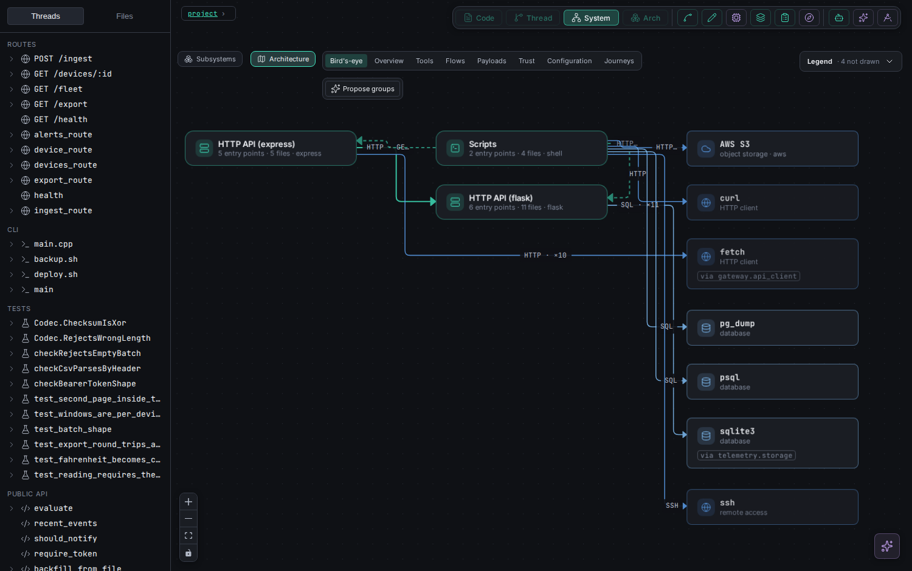

The **lens bar** changes what is drawn, never what is true:

| Lens | Shows |
|---|---|
| **Bird's-eye** | the system in about a dozen boxes: who reaches it, the processes on the flow, the most-called tools, one arrow per pair |
| **Overview** | every process and every tool call, tools folded into one box per category |
| **Tools** | every tool, one edge per call relation |
| **Flows** | processes only, and the hops between them (HTTP, command, MCP tool) |
| **Payloads** | each edge labelled with what crosses it — the keys the code spells |
| **Trust** | only the edges that cross a deployment or trust boundary you stated |
| **Configuration** | which process reads which environment variables |
| **Journeys** | which page sends the user to which page: `<Link href>`, `router.push` and `redirect` literals joined to the page that serves the path (Next.js App Router) |

| Configuration | Journeys |
|---|---|
| 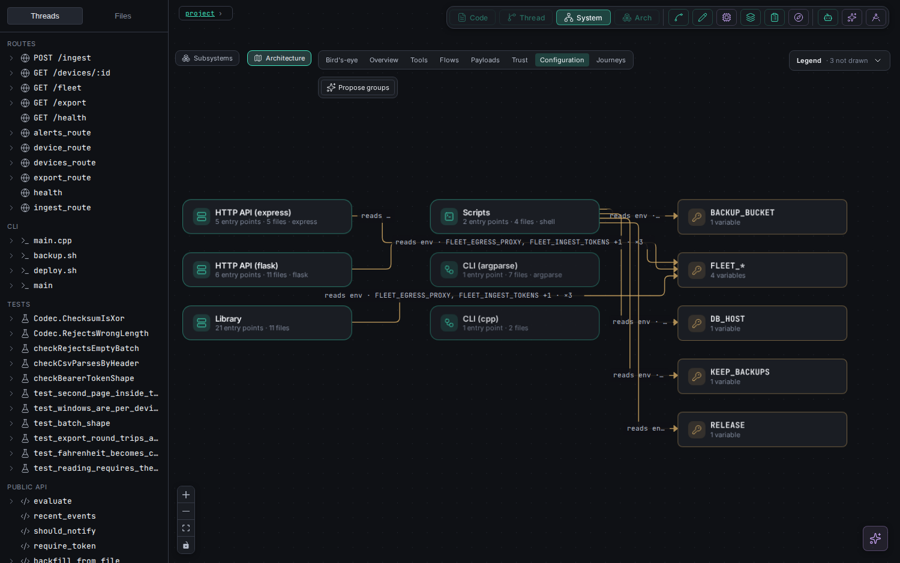 | 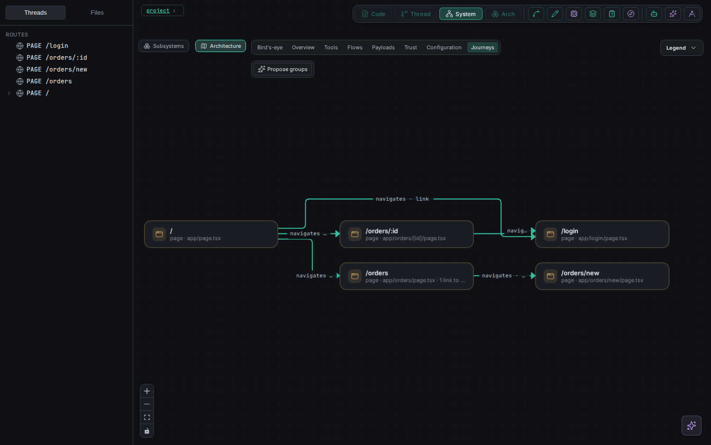 |

**Zoom is a level, in every mode.** Bird's-eye is the picture a newcomer
reads in ten seconds: processes, stores, outside callers, decision
structures and trust boundaries, with each store's zones and SDKs folded into
its card and everything planned but not built folded into one *N planned, not
built* chip. Overview adds the zones in their store's box; Tools and Payloads
draw everything. Zooming out never adds a box, and switching Real / Plan /
Overlay keeps the lens and your zoom.

**Real uses the project's own words** once plan check calls an item realised:
a process takes the plan's name (the chip *named · plan*; the code's name is
in the inspector) and badges who it runs as; a store is one card with its
declared size and writers (*order ledger · 7 zones · 5 writers*) and its zones
in its box, each badged by who may write it; a process that serves calls
nothing in the project makes has an outside caller in front of it (the plan's
external process when it has a boundary to it); each declared state machine
and decision tree is a card on the process that evaluates it. **Flows** (under
the legend) lists the plan's flows; pick one to light its path. The Overlay
matches plan items to these boxes by identity (a zone by its families, a
process by its path, a store by its id), so nothing is drawn twice.

**In → Process → Out.** Click a box and the inspector says what reaches it,
what it does, and who takes what it produces. *In* and *Out* follow the data
(a read brings data back to the caller), each row with the keys the code
spells at the call (never values), the rules on that edge, and, through a
store, who put the data there or who reads it next; click a row to light that
path. *Process* is said in a fixed vocabulary — serves, renders, calls, runs,
routes, reads, writes, watches, stores, queues, decides, validates,
transforms — and only with evidence (click a word for it). A project adds its
own words in `.vibegraph/operations.json` (they draw dashed; an existing word
cannot be redefined). At Tools and Payloads every card carries its words, and
edges show what moves along them as chips: the operation, then the keys.

**Scope with Claude**, at the foot of the card, is for a box the code says
little about (an SDK the project only calls, a platform client). Claude is
shown its call sites, its edges and any ratified software spec, and may
describe it only in those words, citing a line for every claim. The reply
waits as a *proposed scope* — cited words solid, uncited ones faded as
INFERRED, and what the check refused listed under *citations*. Nothing on the
card changes until you **Ratify** (or **Reject**); after that its words and
rows join the bands, marked *scoped*, and `architecture.md` says so. Add a
note to steer it ("what does it return?"); **Re-scope** asks again. On the
command line: `vibegraph-knowledge scope <box>`.

Click a box or an edge for the **inspector**: what it is, *why* its protocol
reads as it does, the threads behind it, the call sites, and **Upstream**,
**Downstream** and **Route from here…** traces. **Play start-here path**
walks the primary path as a story once one is stated.

**Groups — hosts, networks, trust zones.** The code cannot tell which machine
a process runs on. **Propose groups** asks Claude (one call, about a minute;
the map shows a working card and the processes pulse while it drafts). Every
group it proposes must cite a line it was shown — a docker-compose service, a
pm2 entry, a doc line — or it is drawn faded as *INFERRED*. Nothing applies
until you **Ratify** (**Modify** re-drafts with your words; **Reject** drops
it). Ratified groups are saved to `.vibegraph/architecture.json` and appear in
every export.

**Groups that stay true as the project grows.** A group says *who belongs* by
rule as well as by name: everything under `services/`, every cluster of the
`mcp` family, every `@acme/` package. Code added later that fits a rule joins
its group on the next change, with no model. Claude is shown the plan too
(the objective, and where each planned process's code will live), so it can
draw a group for a planned process before its code exists; the group waits
(said in the map's notes) and fills the day its code lands. **Seed groups**
(from the plan, no model) gives every planned process a rule on its `at`
folder in the same way.

When the map outgrows the ratified groups, the bar says so: *since ratified:
1 new, all grouped by rule* is counted and left alone; clusters no rule
fits, a new deployment unit (a compose service, a Dockerfile, a pm2 app), a
new planned process or a group that holds nothing turn it amber —
*changed since ratified* — with **Update groups**. That asks Claude to EXTEND
the ratified groups for what changed: they stay fixed (an update cannot
rename, move or remove anything), and you ratify the additions like any
proposal. Note the map's grain: a box is one framework family per package,
so a new folder inside an existing package joins that package's box; a new
package is a new box.

## 4. Threads — one execution path across files

Pick an entry point in **Threads** (or a box on the map) to open the
**Thread** view: that entry point traced forward through every function it
calls, across files and languages, left to right.

The Threads list is **nested**: a thread whose walk passes through another
entry point sits under it ("sub-thread of X · also called from N"), each
thread listed once; fold a parent with its arrow, or switch to **Flat list**.
Inside a thread, the step where a sub-thread starts carries a **sub-thread**
badge that opens it.

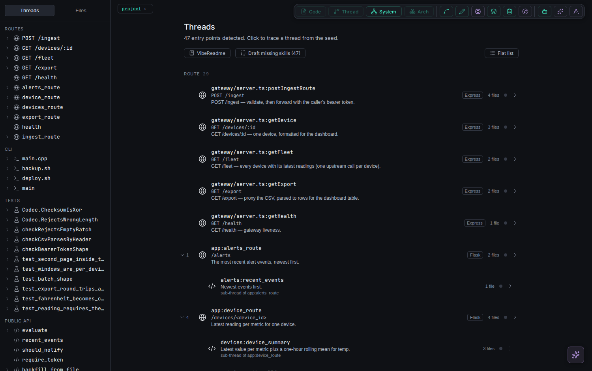

How to read it:

- **Steps** are calls into your own code; **external** terminals are where the
  thread leaves your code (a library, a database, the network), coloured by
  what they do.
- **`dynamic`** (amber) means genuine runtime dispatch — no static answer
  exists. **`unresolved`** (grey `?`) means VibeGraph could not find the
  target. The two are never merged.
- **Containers** (`TRY`, `FOR`, `IF`/`ELSE`, comprehensions) enclose the calls
  inside them. Solid joins always run; dashed edges are conditional.
- Different branches of one thread get different line colours.
- A dashed hop into another process (an HTTP call matched to the route that
  serves it, a script run by path) is drawn to the thread it reaches, and can
  be walked from the step's tooltip.

**Primary / + Secondary / All** (top left of the canvas) decides how much of
the thread is drawn. On real code most of a thread is not the story: local
data work, the language's built-ins, logging and UI state outnumber the calls
that matter many times over.

- **Primary** — what the thread does: the entry point, every call that leaves
  your code (database, network, files, other programs, a model API), runtime
  dispatch, hops to other threads, and the steps on the way to them.
- **+ Secondary** — adds your own helpers that reach no boundary, unresolved
  calls, set-up (building a client), outputs, and **guards**. A guard is an
  `if` that only logs and leaves; it is drawn as one line, e.g.
  `returns if !apiKey`, with a shield icon.
- **All** — every node the static walk reached, exactly as before.

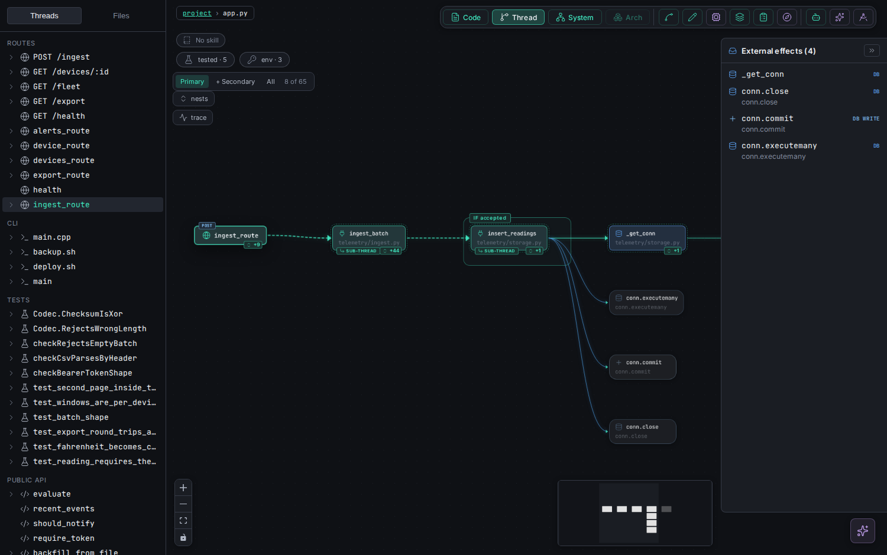

Nothing is thrown away. A card that owns hidden nodes shows **+N**; hover it
for what they are ("12 hidden: 5 local ops, 4 logs, 3 UI state"), click it to
show them in place, and click **hide** to fold them again. Identical calls from
one place collapse to `×N`. The counter says how many cards are drawn out of
the thread's total. VibeGraph remembers your choice; the first one comes from
`VG_THREAD_RANK` (`primary` by default; `secondary` or `all`).

The **code view** shows the same ranks beside the source: a bar in the gutter
of every line a thread reaches — blue for primary (it leaves your code, or it
is an entry point), teal for secondary, grey for tertiary. A function no entry
point reaches is dimmed when the reason suggests dead code (never named
anywhere, exported but unused, or called only from other unreached code); a
dot in the margin marks a line that reads an environment variable, amber when
the project declares it nowhere. Hover any mark for what it is. The layers
button at the bottom right turns all of it off.

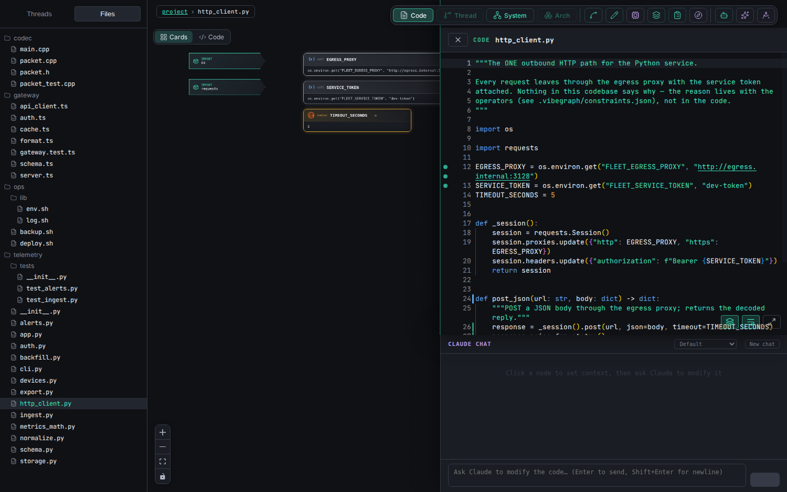

Two chips sit above each thread: **tested · N** (the discovered tests that
exercise it; amber "no test" when none do) and **env · N** (the environment
variables it reads, with how many are declared nowhere). Click either for the
list; a test opens its own thread.

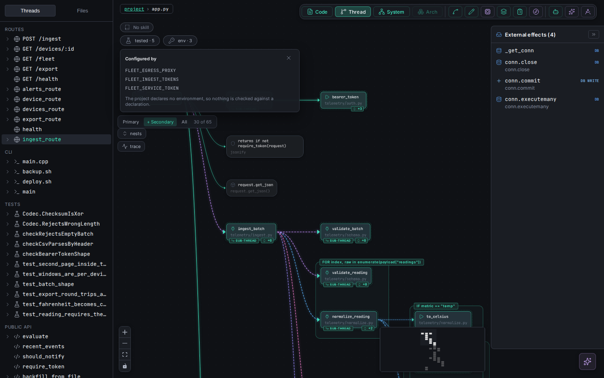

In the **Files** panel, a file nothing reaches is dimmed, a file the parser
could only partly read carries a warning icon, and a file that changed since
the last knowledge export carries a history icon — its contracts describe the
old file. The architecture map's **Configuration** lens draws which process
reads which environment variables, grouped by prefix, with undeclared ones
counted on each group.

**Hover a step** for its tooltip: the call's arguments, where it is written,
and the actions that apply to it:

- **Run to here** — runs the real code up to this node in a throwaway copy of
  your project and shows the actual value. Side effects are scanned first;
  anything that would touch the network, a database or the filesystem asks for
  your consent. If a required input file is missing, Claude drafts an example,
  shows it in full, and your consent is bound to its content hash.
- **Observe** — on a `dynamic` call: runs the enclosing function and reports
  what the receiver really was.
- **Scope** — on a `dynamic`/`unresolved` call: asks Claude what the target
  most likely is (marked as a model's answer).
- **Add to investigation** (clipboard icon) — pins the node on the
  **Investigate** board. Pin nodes from as many threads as a bug crosses, write
  the question and a note on each, then **Hand off**: a Markdown document with
  each pin's code as it is now, saved to `.vibegraph/investigations/` and
  carried by every export (an agent can also read it over MCP).

  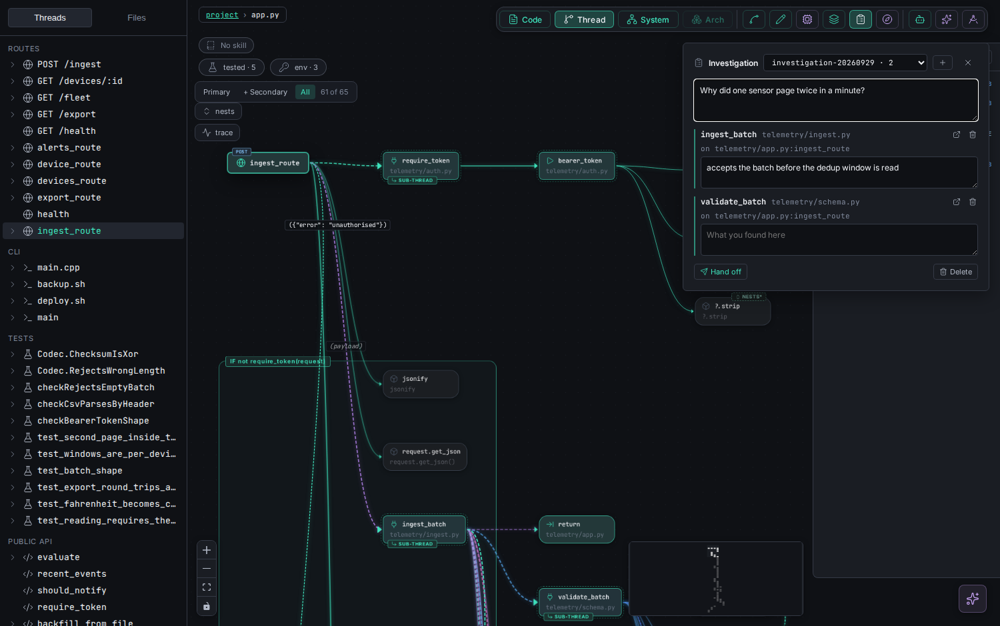

The thread view's **trace** button runs the whole entry point once and
annotates every call site it touched with what it really called
(`.vibegraph/observations.json`, beside the IR, never in it). Python traces
run the code; bash traces point `PATH` at a directory that does not exist, so
every external command is recorded and none is executed.

## 5. Files — one file as structure

**Files → a file** opens the **diagram** view of that file: imports in one
column, module state in the next, then functions and classes laid out by
call flow (a callee to the right of its caller), sized to fit.

The **Cards / Code** toggle (top-left of the canvas) switches between
structural cards for every statement and the **actual source**, highlighted as
your editor shows it, in the same grouping — more compact, every line whole.

## 6. Editing

Every edit goes through one **chokepoint**: the change becomes a CST patch,
is formatted, and is diffed against the original. **If the diff touches any
line outside the node you targeted, it is rejected and nothing is written**,
with the reason. Editing works in all five languages. Each is formatted by
its own formatter when one is installed — `black` (Python), `prettier`
(TypeScript), `shfmt` (bash), `clang-format` (C++, scoped to the lines you
changed), `rustfmt` (Rust) — and every formatted result must pass the same
check; if none is installed, or its output would touch other lines, the edit
is written exactly as you typed it and the result says it was not formatted.

- **Edit** — click a node (or open the node editor from the toolbar), change
  its code in the editor, **Save**. The file on disk changes; the views
  re-derive.
- **Intent** — describe the change in words; Claude drafts it, you see a
  preview, and only **Save** writes it.
- **Describe an insertion** (toolbar) — Claude drafts new code for a place you
  choose; you preview before anything is written.
- **Chat** — ask Claude to change something. It edits through the same
  chokepoint (raw file-write tools are denied to it), so a chat edit is as
  confined as a hand edit.

Work on a clean git tree and review with `git diff`.

## 7. Knowledge that survives: rules, skills, stack

**Every panel opens in one sheet** — Plan, Rules, Stack, Agent Manager,
Direction, Models and the investigation Board — centred over the graph, each
with its own faint tint, and a row of tabs to move between them without
closing. **Dock** (the side-panel icon in the sheet's header) keeps the sheet
at the side with the graph in view, and is remembered; **Key** shows what each
colour and icon stands for. Esc closes it.

**One colour per kind of thing.** A reference the analysis resolved is drawn
as a chip: processes teal, functions green, modules indigo, stores and zones
cyan (a zone dashed), file paths slate, types violet, JSON lime, XML magenta,
identities pink, settings amber, external services coral, rules gold, open
questions amber and dashed — each with its own icon, so colour is never the
only signal. A chip's kind comes from a fact (a plan's `at` is a path, its
`runsAs` an identity), never from the words. Click a chip to go to it: a file
opens, a process opens its thread, a zone or identity opens its card on the
map's Resources lens, a rule opens the Rules panel. A judgement (*pass*,
*realised*, *drifted*, *proposed*…) is a different shape — a pill with a dot.
The theme button in the toolbar switches dark (the default), light, or
follow-the-system.

- **Rules** (toolbar, the scales icon; the badge counts what waits for you) —
  the stated rules the code cannot show: "every outbound HTTP call leaves
  through `http_client.py`", "the export's first four columns never move".
  Write the **reason** into the rule. A rule can carry a **check** VibeGraph
  verifies against the code (`callers-only`, `import-only`, `calls-through`,
  `payload-keys`, `guards`, `not-in-loop`…), and each rule shows its **live
  verdict** — the one `vibegraph-knowledge check` prints: *pass*, *violated*
  (naming the offending call) or *unverifiable*, never a silent pass. **Awaiting
  you** lists a rule an agent stated (*Ratify* or *Remove*) and a change an agent
  proposed, before and after side by side (*Accept* or *Reject*) — the same
  person steps as `constraints ratify` and `constraint accept|reject`, recorded
  in the rule's history with your name (your git `user.name`). Also: all rules,
  violated, unverifiable, by thread, history; the form to state a new one. A
  thread shows the rules routed to it as a **rules** chip beside its tests and
  env chips. Saved to `.vibegraph/constraints.json`.
- **Thread skills** — on a thread, **draft** a skill: Claude writes guidance
  for that thread, citing real node ids (a draft citing an id that does not
  exist is refused). You read it and **ratify** it; only ratified skills are
  used. When the code or the rules routed to the thread change, the skill is
  marked **stale** and shows what changed; **re-affirm** it if it is still
  right.
- **Stack** (toolbar) — every tool the project uses, by role, with the
  evidence, the project modules that wrap them, and any policy stated about
  them (*prefer*, *forbid*, *replace-with*…). A policy's *forbid* and
  *replace-with* are checked like any other rule.
- **Generic direction** (toolbar, compass icon) — six coding skills
  (boundary integrity, change coupling, failure visibility, repetition cost,
  resolvability, retry root cause). Every rule in them carries its reason and
  the check or fact behind it, and each skill says how many of your threads it
  applies to. They are **off by default**; tick one to enable it for this
  project. The **In Claude Code hooks** menu decides what a hooked session is
  sent: the rule *headlines* once per session where a skill applies (default),
  only a rule's reason *when its check fires*, or nothing. They are advice and
  never block. Saved to `.vibegraph/skills.json`; the same switches are
  `vibegraph-knowledge direction` on the command line.

  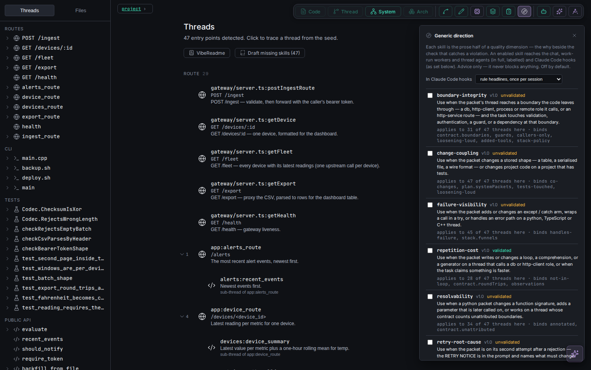

All of this is what the node commands export for a plain Claude session —
see [CLI.md](CLI.md).

## 8. Planning — a hypothetical project beside the real one

**Plan** (toolbar, the drafting-compass icon) opens the plan: a design for
something that does not exist yet, kept in `.vibegraph/plan.json` and never
mixed into what VibeGraph derives from the code. With no plan yet, write the
objective in one line and **Start the plan**. Then ask Claude — the chat, or a
Claude Code session with the hooks — to propose processes, a stack, data
boundaries, primary threads and rules. Its proposals arrive in the panel
marked **PROPOSED**; you **Agree** or **Drop** each one. Claude cannot agree
to anything, and an agreed item it changes goes back to proposed.

The panel shows, for every item:

- **its status:** PROPOSED, agreed, or promoted;
- **its verdict against the code**, recomputed each time the code changes:
  - **realised**: the code has it;
  - **drifted**: the code has something different, and the panel says what;
  - **not built**: nothing yet;
  - **unanchored**: give the process an `at` path so it can be checked.

Each item is one header line (its chip, its name, its status and verdict) and
at most three labelled bullets — **does**, **where**, **runs as** for a process
— drawn as chips: its folder, the file it starts from, the module it uses, the
identity it runs as and the zones it writes and reads. A list longer than three
shows three and "+N"; the full reading of the verdict is folded under **Why
realised · 14 files · 9 entry points**. The verdict counts at the top are a
scorecard: click **4 drifted** to see only those four; the left column jumps
to a section. `plan check --json` carries the same bullets (`facts`) beside
the prose (`detail`).

Planned threads show their primary steps as chips. A realised one has a **Thread**
button that opens the real thread it matched. A planned rule is checked as
advice and blocks nothing until you **Promote** it into the stated rules. The
plan is kept small on purpose (hard caps on every section), and every process
and thread must say which part of the objective it serves. **Close the plan**
when it is done: it stays on disk and stops being sent to sessions.

**Open questions** are shown in full, however long. Each has **Close —
answered** and **Drop — not needed**; both ask you to confirm and take an
optional note (the answer, or why it no longer matters), which goes into the
plan's history. A question whose text starts "ANSWERED" carries a green
*answered* tag — a tag, not a button. Closed and dropped questions are kept
under **Closed and dropped**, with who, when and the note, and **Reopen**. Only
open questions count against the cap of ten; at the cap, the add box lists the
questions that look answered and offers **Close all answered**. Near the top
of **Everything**, a summary ("9 open questions (cap 10) · 4 look answered")
jumps to them. These are your steps: Claude cannot close or drop a question.
On the command line: `plan close open q3 --note "…"`, `plan drop open q3`,
`plan reopen open q3`.

The objective is yours alone. If Claude proposes a different one, it
appears under **Open questions** as "Proposed objective: …" with an **Adopt**
button. An item whose "serves" shares no word with the objective carries a
dashed **serves the objective?** chip. That's a word-match guess, so check
it rather than trust it. While the plan is open, every prompt in a hooked
Claude session carries the objective in one line, so it stays in sight.

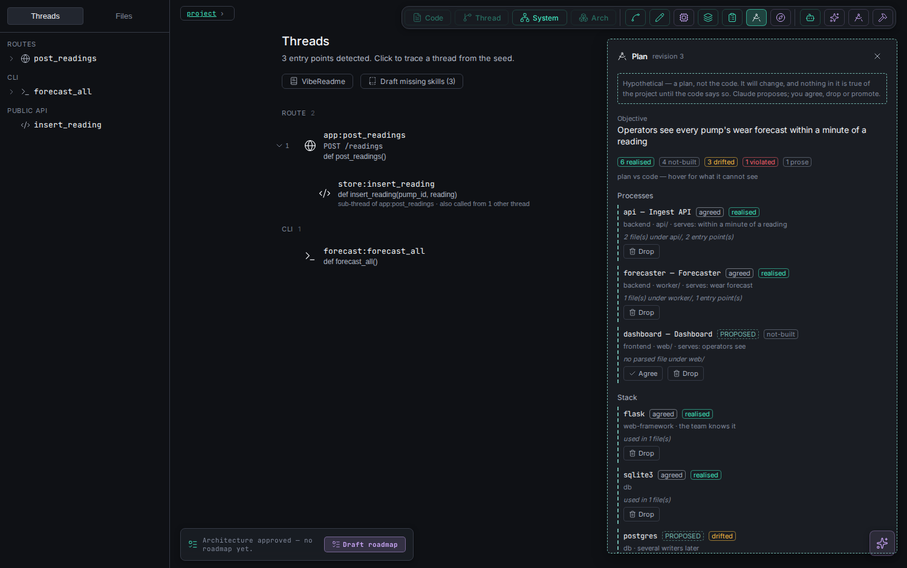

On the **architecture map**, a **Real · Plan · Overlay** switch (top right)
appears while a plan exists:

- **Plan** draws the plan alone, as dashed "planned" boxes.
- **Overlay** draws the real map with the plan on it. A realised item is its
  real box, chipped **planned ✓**; only what the code does not have yet is a
  dashed box. Nothing is drawn twice, and nothing is left out.

What the plan says is on the map too, not only its boxes:

- A process card's **N threads** chip opens its planned threads as dashed
  step chains, coloured by plan check (realised / drifted / not built); a
  step plan check did not find is struck through.
- **N rules** and **N open** chips sit on the process, tool or boundary a
  rule or question is `about` (a rule without `about` lands on the one
  process whose files it names).
- A boundary reads `SQL · 3 keys` — the keys on hover — and is drawn in the
  warning colour when it crosses two stated **trust zones**.
- What has no place on the map (project-wide rules and questions, a boundary
  whose end is not drawn) is listed under the switch, never dropped.
- **Seed groups** proposes deployment and trust groups for
  `.vibegraph/architecture.json`, read off the plan — no model, no tokens,
  pending until you ratify it.

| Plan | Overlay |
|---|---|
| 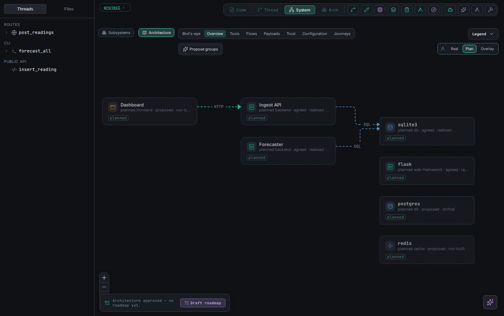 | 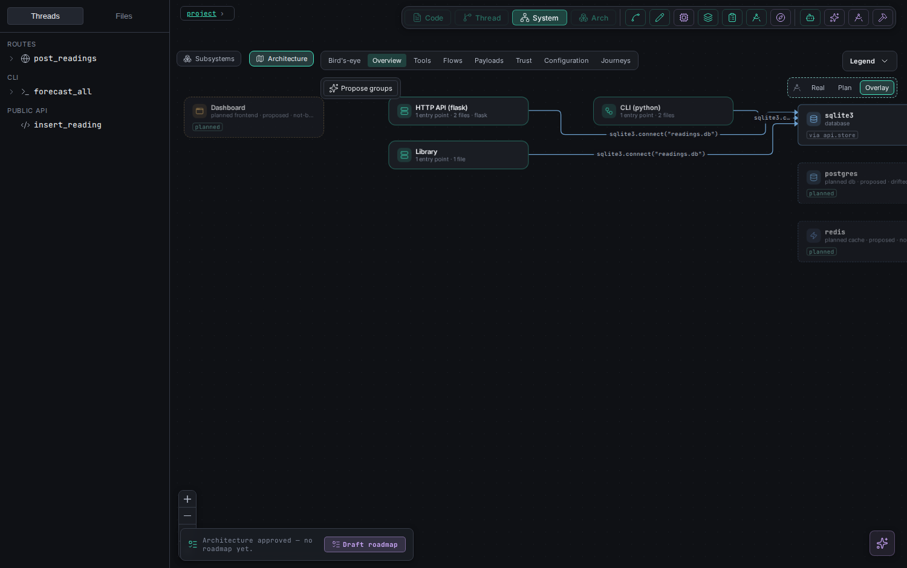 |

The greenfield flow (describe → architecture → roadmap) writes into the same
plan: an architecture you accept becomes agreed processes and boundaries.
The command line has all of this too (`vibegraph-knowledge plan …`, see
[CLI.md](CLI.md)).

**Software specs** sit at the foot of the Plan panel: one per tool the
project builds on (a platform SDK, a database, an API), drawn from the tool's
own documents with every item quoting them.

- A **DRAFT** shows how many of its items are **inferred** (not in the docs)
  and how many the citation gate dropped. **Ratify** re-checks every quote
  against the saved documents, then puts the spec to use.
- A ratified spec's **Add to plan** puts the tool into the planned stack and
  its rules into the planned rules, all proposed and each quoting its source.
- From then on, a hooked Claude session gets the spec whenever its work
  touches the tool.
- Drafting a spec spends tokens and may fetch a URL, so it is done on the
  command line: `vibegraph-knowledge software add <tool> --from <docs url or
  file>`.

## 9. Agents

The **Agent Manager** (toolbar) opens on **Claude Code + hooks**, the
arrangement the head-to-heads proved: one Claude Code session with
VibeGraph's hooks, so each prompt gets the contracts, stated rules and
ratified skills of the threads it names, and every edit is re-checked — a new
violation of a stated rule is stopped and explained to Claude.

1. Describe the task and press **Run with Claude Code**. The project is
   snapshotted first; you watch the session's tool calls (and any edit a hook
   blocked) as it works, and can **Stop** it.
2. When it ends, VibeGraph collects the evidence itself: every changed file
   with its diff, the stated rules checked before and after (a rule the run
   newly broke is named), the tests that reach the changes, and Claude's own
   summary, labelled as a self-report.
3. **Accept** keeps the changes; **Reject** restores the snapshot.

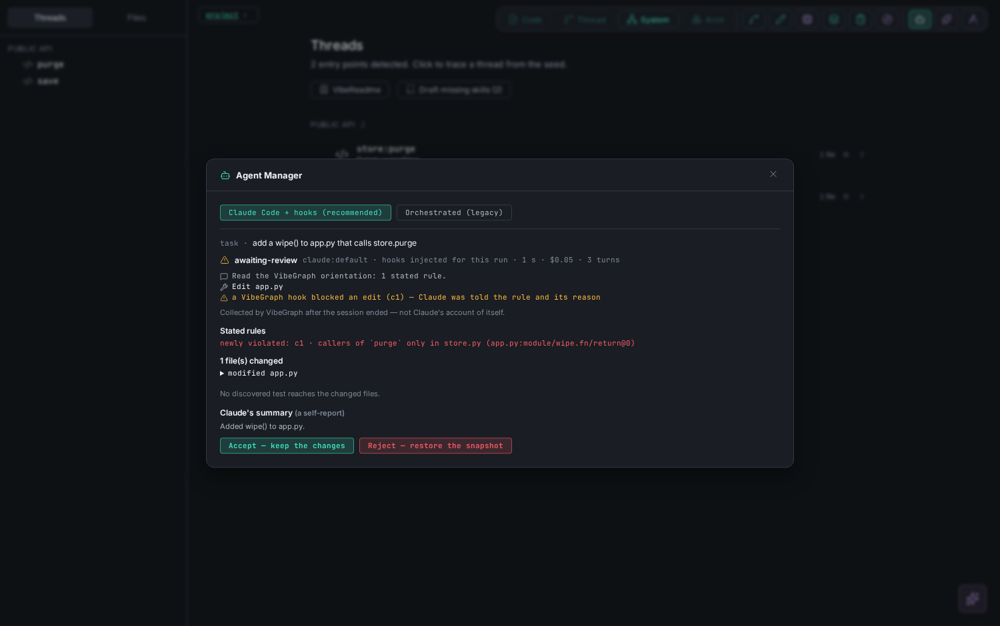

*(Captured with the stub model the end-to-end test uses; the hooks it ran and
the block they raised are real.)*

The hooks are passed to that one session only; nothing is written to your
project's `.claude/` (and if you installed them yourself with `init --hooks`,
they are not added twice). It uses the **Workers** model tier, which must be a
Claude model.

**Orchestrated (legacy)**, one toggle away, is the earlier Agent Manager,
unchanged — it turns a task into work on threads:

1. Describe the task, **naming the code it touches** (backticked symbols, file
   names) — the decomposition is lexical and needs names to match.
2. Choose **Gated** (you review every packet) or **Orchestrated** (you confirm
   one objective; an orchestrator writes each worker's task and reviews each
   packet against the constraints).
3. **Plan the run** — the task is mapped onto the threads that own it,
   dependencies first. Nothing runs until you ratify (gated) or confirm the
   objective (orchestrated).
4. Each packet gets one bounded worker: VibeGraph's tools only, edits through
   the chokepoint, confined to its packet's files, told to escalate rather
   than guess. Evidence (diffs, IR changes, checks) is collected by the
   server, not reported by the worker.

**Models** (toolbar) sets which model does which kind of work — including a
local Ollama model for routine work.

## 10. Driving it from your own Claude Code session

The same tools the chat uses are served over MCP:

```bash
claude mcp add vibegraph --transport http http://localhost:4200/mcp
```

Then, in that session: *"trace the thread for `ingest_route`"*, *"what
is the blast radius of changing `normalize`?"*, *"state a constraint that…"*,
*"plan the work to…"*. Edits it makes go through the chokepoint too.

## 11. A good first session on your own code

1. `vibegraph-knowledge view your-project`, open the map, switch to **Bird's-eye**.
2. **Propose groups**, read what it cites, **Ratify** or **Modify**.
3. Open the busiest process's threads; follow one end to end.
4. Hover a few `dynamic` calls; **Observe** or **trace** where it matters.
5. State the two or three rules everyone on the team knows and the code does
   not say — with their reasons.
6. Draft and ratify skills for the threads you work on most.
7. Run `vibegraph-knowledge init --hooks --skill` and `vibegraph-knowledge
   export` ([CLI.md](CLI.md)) so every Claude Code session in that repo is
   handed the contracts and rules of what it touches, and has its edits
   checked against them.
